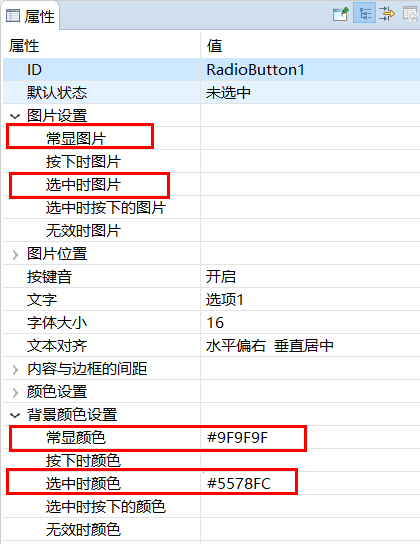
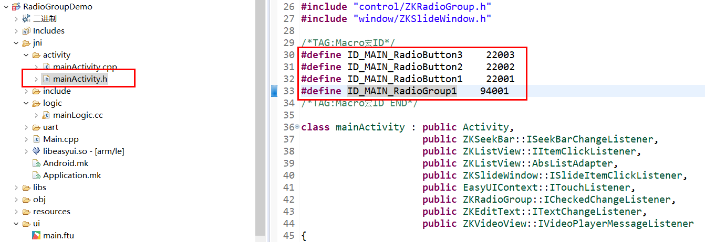
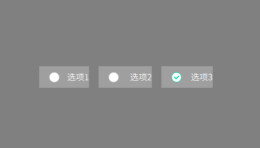

# 单选组 RadioGroup
对于多个选项，单选的情况，我们可以直接使用 `单选组` 控件。  
当点击其中某个选项时时，该选项会自动切换为选中状态，同一组中的其他选项会变为非选中状态。这些选项切换状态的同时，也会根据属性中设置的图片、颜色等自动切换。

## 如何使用
1. 双击打开UI文件
2. 在右侧控件集合中找到 `单选组` 控件集合   
     
    
3. 鼠标左键点击 `单选组` 控件不放，然后将其拖拽到任意位置，松开左键，就能看到自动生成一个矩形区域。  
   它表示一个可以容纳 `选项` 控件的容器。  
4. 可以采用同样拖拽的操作，添加多个 `选项` 控件到刚才的矩形区域内部。  
5. 左键点击添加的 `选项` 控件，在编辑器的右侧就能看到它的相关属性。    
   可以根据需要，设置每个选项各个状态的图片、各个状态的颜色。 这里重点注意 **选中时的图片及颜色** 属性。  
  
    
  
  如果你设置了图片，发现图片大小显示异常，可以在 **图片位置** 属性中，调整图片的位置及大小。  
  我们还可以在 **默认状态** 属性中设置 **选中** 或者 **未选中**
6. 属性设置完成后再编译，对应的`Logic.cc` 中会生成它的关联函数。  
   当你点击其中某个选项时，关联函数会被系统调用， 其中参数 `int checkedID` 表示被点击选项的 `ID`。  
   我们可以根据这个ID值，来判断当前点击的是哪一个选项。
   这个 `ID` 是一个宏定义整型值。UI文件经过编译后，每个控件都会自动生成对应的宏ID，(关于该宏的更多信息，可查看它的[命名规则](name_rule.md#id_macro_rule))，  
   每个选项的宏ID可以在对应的 `Activity.h` 头文件中找到。例如  
   
     
   
   那么在关联函数中，可以对点击项进行判断。
    ```c++
    static void onCheckedChanged_RadioGroup1(ZKRadioGroup* pRadioGroup, int checkedID) {
      LOGD("选中项的ID = %d", checkedID);
      switch (checkedID) {
        case ID_MAIN_RadioButton1:
          LOGD("第一项被选中");
          break;
        case ID_MAIN_RadioButton2:
          LOGD("第二项被选中");
          break;
        case ID_MAIN_RadioButton3:
          LOGD("第三项被选中");
          break;
        default:
          break;
      }
    }
    ```
 
7. 下载调试，查看效果。
 

## 样例代码  

请参考[样例代码](demo_download.md#demo_download)中的RadioGroupDemo工程。   
样例预览效果图：  


