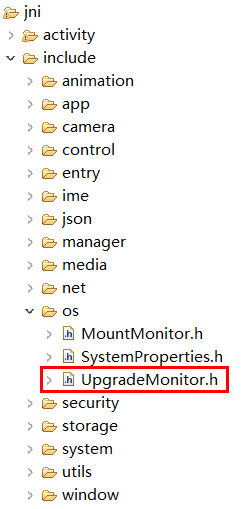
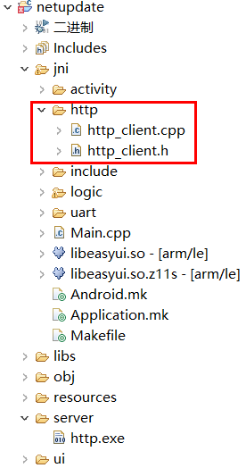
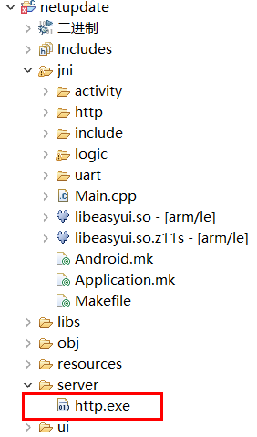

# 远程升级
目前系统没有直接进行远程升级的接口。   
但是我们可以了解TF卡检测升级的机制后，再添加上一些自己的代码，即可达到远程升级的目的。  
我们先介绍一般插TF卡升级的流程。
## TF卡检测升级流程
当系统启动或者插入TF卡的时候，如果[TF卡正常挂载](tf.md)，系统会检测**TF卡根目录**下是否存在 **update.img** 文件 (系统内，TF卡根目录映射为 `/mnt/extsd`)。  
如果存在，进一步校验文件是否符合要求，如果通过校验，然后弹出升级提示界面，用户可以选择进行升级。  
如果不存在，结束检测流程，界面无任何动作。    

## 实现步骤
1. 首先我们要下载升级镜像 `update.img`。  
  一般情况下，通过HTTP协议下载文件是最简单的方式，当然，也可以根据实际情况选择其他协议。  
  下载后，将镜像文件保存到TF卡目录`/mnt/extsd/` 下。   
  > [!Note]
  > 如果机器内没有插TF卡，这个目录仍然可以写入，因为它是保存在内存中的。 受限于内存大小，如果镜像文件过大，会造成设备运行异常、或者升级失败。  
  如果有插入TF卡，可以忽略内存大小的问题。
2. 调用升级检测函数   
   先下载 [UpgradeMonitor.h ](https://docs.flythings.cn/src/UpgradeMonitor.h) 源文件，保存到项目的 `jni/include/os` 目录下。  
   
   
   
   然后调用接口检测升级。
   ```c++
   #include "os/UpgradeMonitor.h"
   ```
   ```c++
   //主动检测 /mnt/extsd目录下是否有正确的update.img文件，
   //如果有，则弹出升级提示框，
   //如果没有，则无任何动作
   UpgradeMonitor::getInstance()->checkUpgradeFile("/mnt/extsd");
   ```
   弹出升级提示界面后，用户可以选择是否升级。  
   至此，已完全实现远程升级功能。

## 下载文件后自动更新
如果希望下载升级文件后，强制更新，那么只需要参考[自动升级](autoupgrade.md)文档，用代码创建 `zkautoupgrade`文件即可。

## 避免反复升级
在上面的步骤中，我们将镜像文件保存在 `/mnt/extsd/`目录下，成功升级后，机器会自动重启，  
这时，系统会执行常规的升级检测流程，由于镜像文件的存在，升级提示界面再一次弹出，导致了重复升级。

### 解决方法
下载镜像文件时，将它保存到非 `/mnt/extsd/` 目录， 例如： `/mnt/extsd/temp/`  ，
并且，也同步修改调用检测函数的参数。  
```c++
UpgradeMonitor::getInstance()->checkUpgradeFile("/mnt/extsd/temp");
```


## 样例参考
[完整样例下载](https://docs.flythings.cn/src/netupdate.zip)  
样例中简单实现了http客户端下载文件，参考源码http部分。
下载文件属于耗时操作，推荐放到独立线程中，这样才不会影响界面的即时响应。    

  
* 关键代码
  ```c++ 
    class DownloadThread : public Thread {
        protected:
        virtual bool threadLoop(){
            http::HttpClient http;
            mTextview1Ptr->setText("下载升级文件");
            //创建升级文件的保存路径
            system("mkdir /mnt/extsd/temp");
            //这里修改为真实服务IP
            string err = http.Download("192.168.1.1/update.img", 80, "/mnt/extsd/temp/update.img");
            mTextview1Ptr->setText(err);
            if (err.empty()) {
                UpgradeMonitor::getInstance()->checkUpgradeFile("/mnt/extsd/temp");
            }
            mButton1Ptr->setInvalid(false);
            return false;
        };
    };
  ```

* 服务端实现  
  为了方便测试，例程中包含了一个 `http.exe`，它是一个静态文件服务。   
  
    
  
  将制作好的升级镜像文件 `update.img` 和 `http.exe` 放到同一文件夹下，然后在电脑上双击执行 `http.exe`，只要网络正常，即可 通过网址下载同目录下的镜像文件。  
  例如：  
  http://192.168.1.1/update.img    
  (请注意将IP地址修改为电脑当前IP)  

服务端开启后，再运行样例代码，即可测试远程升级。
