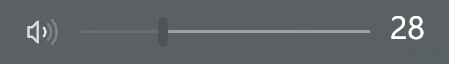
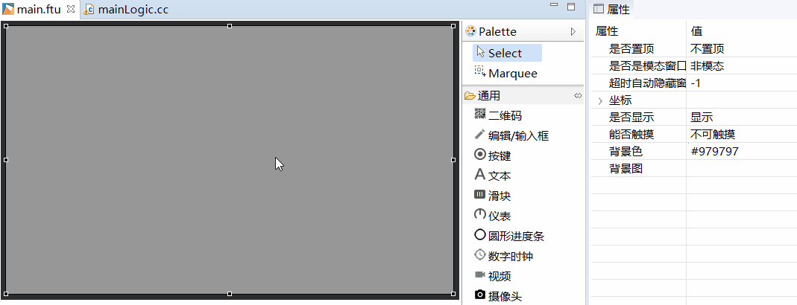
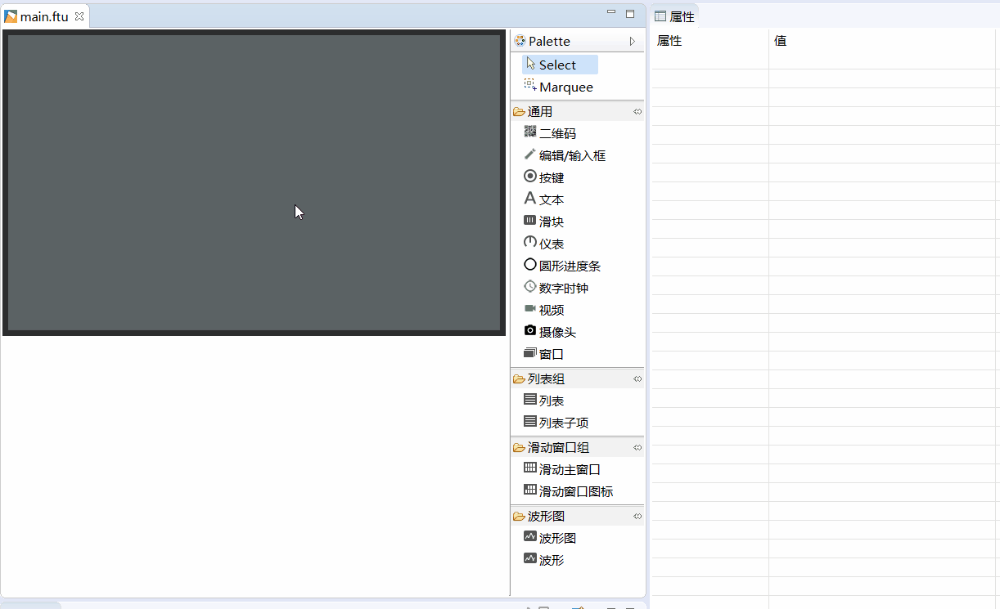
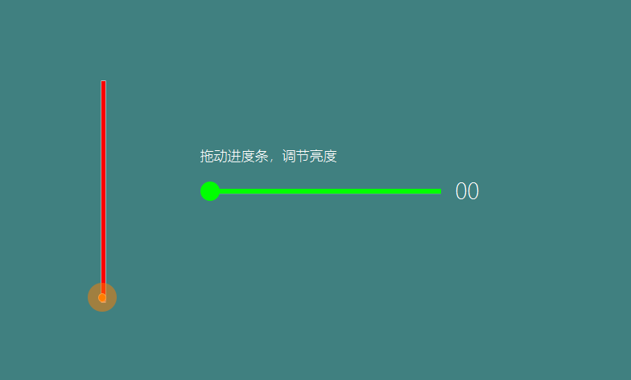

# 滑块/进度条
## 如何使用滑块控件？
很多情况下，我们会用到进度条，例如:  
**调节音量**  
  

利用简单的几张图片，我们也能快速达到这样的效果。  
1. 首先，我们准备四张资源图片  
  * 背景图    
      
  * 有效图  
    
  * 滑块   
     
  * 滑块按下  
    

2. 在编辑器中，创建一个滑块控件  

 
  如果你不了解如何创建控件，[参考创建按键控件](#add_button)
3. 默认的滑块样式是透明的，我们必须为其添加足够的图片资源，它才能正常工作。  
    在属性表中，我们分别设置**有效图 、滑块常显图片、滑块按下时的图片、背景图** 图片

      
4. 上一步完成后，一个滑块的创建基本完成了。如何想在工具中预览滑块滑动的效果，可以修改
 **最大值**属性和**默认进度值**属性。在实时的预览中，你就可以看到滑块游标的位置变化。

## 如何在代码中控制滑块的进度？ 如何获得滑块的当前进度？
如果我们用滑块实现了一个音量条，那肯定需要知道当前音量条的进度值，并且，一旦音量条有变化，我们还必须同步调节音量。  
所有，我们有如下3个函数来解决这些问题。  
1. 进度值变化监听函数  
  如果你在UI文件中创建了滑块控件，那么该函数在 **编译FlyThings** 后，将会自动添加到相应的`XXXXLogic.cc`文件中。  
  当在触摸屏上滑动进度条时、或者进度条当前值有变化时，系统会自动调用该函数。
```
  static void onProgressChanged_XXXX(ZKSeekBar *pSeekBar, int progress) {
      //LOGD("XXXX滑块的进度值变化为 %d !\n", progress);
}
```
2. `void setProgress(int progress)`  
  用于设置滑块当前进度。 例如：  
  ```  
  //将滑块进度设置为28
  mSeekbarPtr->setProgress(28)
  ```
3. `int getProgress()`  
  用于获得当前滑块的进度值。例如：  
  ```
  int progress = mSeekbarPtr->getProgress();
  LOGD("当前滑块的进度值为 %s", progress);
  ```


## 样例代码  
更多滑块控件的使用，参考[样例代码](demo_download.md#demo_download)中的SeekBarDemo工程

样例预览效果图：  


