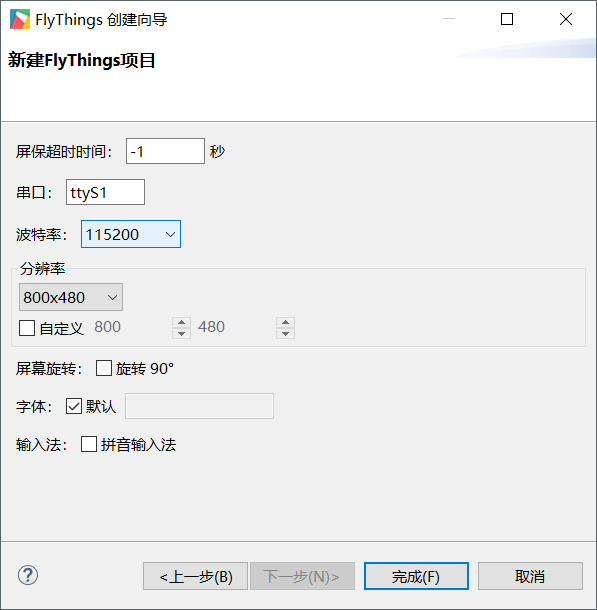
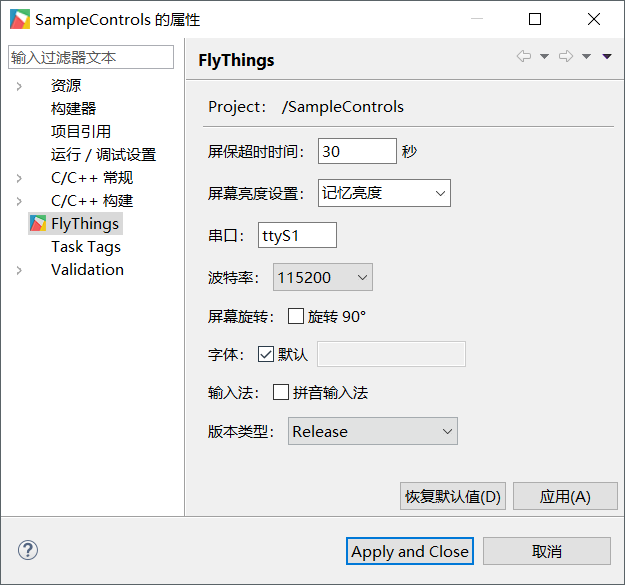

# 如何配置串口
## 串口号的选择
    
由于软件与硬件的设计兼容问题，导致软件串口号与硬件上的串口号标识可能存在不同的情况，具体对应关系如下：

* Z11系列平台

| 软件串口号 | 硬件串口号 |
|:--------:|:-------:
| ttyS0   | UART1  | 
| ttyS1   | UART2  | 

* Z6系列平台

| 软件串口号 | 硬件串口号 |
|:--------:|:-------:|
| ttyS0   | UART0  | 
| ttyS1   | UART1  | 
| ttyS2   | UART2  | 
  
* A33系列平台

| 软件串口号 | 硬件串口号 |
|:--------:|:-------:|
| ttyS1   | UART1  | 
| ttyS2   | UART2  | 
| ttyS3   | UART3  | 

## 串口波特率配置
1. 新建工程时配置波特率  

  

2. 工程属性修改波特率
  右键工程, 在弹出框中选择 Properties 选项, 弹出如下属性框  

  

## 串口打开与关闭
打开源码路径 jni/Main.cpp；我们可以看到在程序初始化和销毁时分别有对串口打开和关闭的操作

```c++
void onEasyUIInit(EasyUIContext *pContext) {
    LOGD("onInit\n");
    // 打开串口
    UARTCONTEXT->openUart(CONFIGMANAGER->getUartName().c_str(), CONFIGMANAGER->getUartBaudRate());
}

void onEasyUIDeinit(EasyUIContext *pContext) {
    LOGD("onDestroy\n");
    // 关闭串口
    UARTCONTEXT->closeUart();
}
```