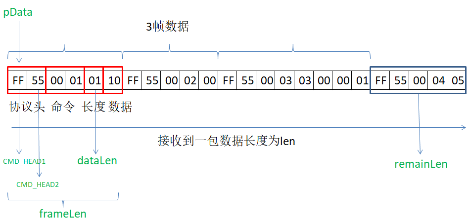

# Communication framework explanation

This chapter focuses on the implementation principle of the communication framework. There are many theoretical things. The first time you can give a rough overview of the communication model, you will probably understand the communication model. The supporting [case](serial_example.md) will do it yourself, and then go back to consolidate the principle. After playing it a few times, you can customize the protocol any way you want.

## Code frame


The software APP part is divided into two layers
* Serial port HAL layer of uart protocol analysis and encapsulation
	* UartContext: The physical control layer of the serial port, which provides the serial port switch, sending and receiving interfaces
	* ProtocolData: Define the data structure of the communication, used to save the actual variables converted from the communication protocol;
	* ProtocolSender: complete the encapsulation of data transmission;
	* ProtocolParser: Complete the protocol parsing part of the data, and then put the parsed data into the ProtocolData data structure; at the same time, it manages the callback interface for the application to monitor serial data changes;
* APP application interface layer
	* Register the serial port data receiving monitor through the interface provided by ProtocolParser to obtain the updated ProtocolData of the serial port.
	* Send command information to MCU through the interface provided by ProtocolSender

Let's refine this process:


You can clearly see that the two processes of **accept** and **send** are up and down, and the functions of each layer are relatively clear;

Specific to the process corresponding to the code:


Regardless of whether it is a receiving or sending process, it is ultimately necessary to read and write to the serial port through the `UartContext`. This is a standardized process, so we basically do not need to modify the `UartContext`, and we can ignore how it is implemented. Yes, of course, you can check it out if you are interested.

At this point, we have a general understanding of this communication model, and then we will look at the implementation of the specific code.

## How to use and modify the protocol receiving part

### Modification of communication protocol format
Here we give an example of a more common communication protocol:

| Protocol header (2 bytes) | Command (2 bytes) | Data length (1 byte) | Data (N) | Check (1 byte optional) |
| --- | --- | --- | --- | --- |
| 0xFF55 | Cmd | len | data | checksum |

The CommDef.h file defines synchronization frame header information and minimum data packet size information:
```c++
// When you need to print the protocol data, open the following macro
//#define DEBUG_PRO_DATA

// Support checksum verification, open the following macro
//#define PRO_SUPPORT_CHECK_SUM

/* SynchFrame CmdID  DataLen Data CheckSum (Optional) */
/*     2Byte  2Byte   1Byte	N Byte  1Byte */
// Minimum length with CheckSum: 2 + 2 + 1 + 1 = 6
// Minimum length without CheckSum: 2 + 2 + 1 = 5

#ifdef PRO_SUPPORT_CHECK_SUM
#define DATA_PACKAGE_MIN_LEN		6
#else
#define DATA_PACKAGE_MIN_LEN		5
#endif

// Sync frame header
#define CMD_HEAD1	0xFF
#define CMD_HEAD2	0x55
```

ProtocolParser.cpp file, configuration file command format:
```c++
/**
 * Function: Analyze protocol
 * Parameters: pData protocol data, len data length
 * Return value: the length of the actual resolution protocol
 */
int parseProtocol(const BYTE *pData, UINT len) {
	UINT remainLen = len;	// Remaining data length
	UINT dataLen;	// Packet length
	UINT frameLen;	// Frame length

	/**
	 * The following parts need to be modified according to the protocol format to parse out the data of each frame
	 */
	while (remainLen >= DATA_PACKAGE_MIN_LEN) {
		// Find the data header of a frame of data
		while ((remainLen >= 2) && ((pData[0] != CMD_HEAD1) || (pData[1] != CMD_HEAD2))) {
			pData++;
			remainLen--;
			continue;
		}

		if (remainLen < DATA_PACKAGE_MIN_LEN) {
			break;
		}

		dataLen = pData[4];
		frameLen = dataLen + DATA_PACKAGE_MIN_LEN;
		if (frameLen > remainLen) {
			// Incomplete data content
			break;
		}

		// To print a frame of data, open the DEBUG_PRO_DATA macro in the CommDef.h file when needed
#ifdef DEBUG_PRO_DATA
		for (int i = 0; i < frameLen; ++i) {
			LOGD("%x ", pData[i]);
		}
		LOGD("\n");
#endif

		// Support checksum verification, open the PRO_SUPPORT_CHECK_SUM macro in CommDef.h file when needed
#ifdef PRO_SUPPORT_CHECK_SUM
		// Check code
		if (getCheckSum(pData, frameLen - 1) == pData[frameLen - 1]) {
			// Parse a frame of data
			procParse(pData, frameLen);
		} else {
			LOGE("CheckSum error!!!!!!\n");
		}
#else
		// Parse a frame of data
		procParse(pData, frameLen);
#endif

		pData += frameLen;
		remainLen -= frameLen;
	}

	return len - remainLen;
}
```
The above analysis process is a bit complicated. Let’s first give a picture, and then analyze it may be easier to understand; a packet of data may contain 0 to multiple frames of data, in the picture below, we have marked 3 frames of data, and There is still a frame of incomplete data, and there are 5 less data. The incomplete frame of data will be spliced into the next packet of data



* Protocol header needs to be modified

```c++
/* 1.Modify the definition of the protocol header. If the length of the protocol header changes, pay attention to modifying the 
statement of the protocol header judgment part.*/
#define CMD_HEAD1	0xFF
#define CMD_HEAD2	0x55

// 2.You need to modify this when the length of the protocol header changes.
while ((mDataBufLen >= 2) && ((pData[0] != CMD_HEAD1) || (pData[1] != CMD_HEAD2)))
```

* Modification of changes in the position of the protocol length or the length calculation method

```c++
// Here pData[4] represents the fifth data is the length byte, if it changes, please modify it here.
dataLen = pData[4];
/* The frame length is generally the data length plus the head and tail length. If the length calculation method passed in the 
agreement changes, modify this part.*/
frameLen = dataLen + DATA_PACKAGE_MIN_LEN;
```

* When the verification changes

```c++
/**
 * By default, we turn off checksum verification. If you need to support checksum verification, open the PRO_SUPPORT_CHECK_SUM 
 * macro in the CommDef.h file
 * When the verification is different, the verification method needs to be modified.
 * 1.Check the content changes to modify this location
 *     if (getCheckSum(pData, frameLen - 1) == pData[frameLen - 1])
 * 2.Check the calculation formula changes to modify the content in the getCheckSum function
 */

/**
 * Get check code
 */
BYTE getCheckSum(const BYTE *pData, int len) {
	int sum = 0;
	for (int i = 0; i < len; ++i) {
		sum += pData[i];
	}

	return (BYTE) (~sum + 1);
}
```

* When the reception of a frame of data is completed, the program will call procParse to analyze

```c++
	// Support checksum verification, open the PRO_SUPPORT_CHECK_SUM macro in CommDef.h file when needed
#ifdef PRO_SUPPORT_CHECK_SUM
	// Check code
	if (getCheckSum(pData, frameLen - 1) == pData[frameLen - 1]) {
		// Parse a frame of data
		procParse(pData, frameLen);
	} else {
		LOGE("CheckSum error!!!!!!\n");
	}
#else
	// Parse a frame of data
	procParse(pData, frameLen);
#endif
```

### How to connect communication protocol data with UI controls
Continuing the previous protocol framework, we enter the parsing part of procParse.
The key code here is: ProtocolParser.cpp
Open the file and find void procParse(const BYTE *pData, UINT len)
```c++
/*
 * Protocol analysis
 * Input parameters:
 *     pData: Start address of a frame of data
 *     len: Length of frame data
 */
void procParse(const BYTE *pData, UINT len) {
	/*
	 * Parse the Cmd value to obtain the data and assign it to the sProtocolData structure
     */
	switch (MAKEWORD(pData[2], pData[3])) {
	case CMDID_POWER:
		sProtocolData.power = pData[5];
		LOGD("power status:%d",sProtocolData.power);
		break;
	}
	notifyProtocolDataUpdate(sProtocolData);
}

```
The above `MAKEWORD(pData[2], pData[3])` represents the Cmd value in our protocol example;
When the data analysis is completed, the page UI update is notified by `notifyProtocolDataUpdate`. For this part, please refer to the UI update part below

* data structure

The above protocol is parsed into the sProtocolData structure. sProtocolData is a static variable used to save the data value sent by the MCU (or other device) serial port.
This data structure is in the ProtocolData.h file. Here you can add communication variables that need to be used in the entire project
```c++
typedef struct {
	// You can add protocol data variables here
	BYTE power;
} SProtocolData;

```

* UI update

The UI interface has completed the registerProtocolDataUpdateListener when the tool generates Activity.cpp, which means that the page program in the logic will receive the data when the data is updated.

```c++
static void onProtocolDataUpdate(const SProtocolData &data) {
    // Serial data callback interface
	if (mProtocolData.power != data.power) {
		mProtocolData.power = data.power;
	}

	if (mProtocolData.eRunMode != data.eRunMode) {
		mProtocolData.eRunMode = data.eRunMode;
		mbtn_autoPtr->setSelected(mProtocolData.eRunMode == E_RUN_MODE_MANUAL);
		if (mProtocolData.eRunMode != E_RUN_MODE_MANUAL) {
			mbtn_external_windPtr->setText(mProtocolData.externalWindSpeedLevel);
			mbtn_internal_windPtr->setText(mProtocolData.internalWindSpeedLevel);
		}
	}
    ...
}

```
In the code, we see a variable ProtocolData, which is a static variable in the page. It will be initialized during onUI_init().
Such as:
```c++
static SProtocolData mProtocolData;
static void onUI_init() {
	//Tips : Add the display code of UI initialization here, such as: mText1->setText("123");
	mProtocolData = getProtocolData(); // Initialize the structure of the serial port data.
	// Start the UI display of the initial page
}

```

## Serial data transmission
Open ProtocolSender.cpp
When the APP layer needs to send data to the MCU (or other devices), it is enough to call sendProtocol directly.
The specific protocol encapsulation is completed by the sendProtocol method. Users can modify this part of the code according to their own protocol requirements.
```c++
/**
 * Need to be spliced according to the protocol format, the following is just a template
 */
bool sendProtocol(const UINT16 cmdID, const BYTE *pData, BYTE len) {
	BYTE dataBuf[256];

	dataBuf[0] = CMD_HEAD1;
	dataBuf[1] = CMD_HEAD2;			// Sync frame header

	dataBuf[2] = HIBYTE(cmdID);
	dataBuf[3] = LOBYTE(cmdID);		// Command byte

	dataBuf[4] = len;

	UINT frameLen = 5;

	// data
	for (int i = 0; i < len; ++i) {
		dataBuf[frameLen] = pData[i];
		frameLen++;
	}

#ifdef PRO_SUPPORT_CHECK_SUM
	// Check code
	dataBuf[frameLen] = getCheckSum(dataBuf, frameLen);
	frameLen++;
#endif

	return UARTCONTEXT->send(dataBuf, frameLen);
}
```
You can operate when a button is pressed on the interface:
```c++
BYTE mode[] = { 0x01, 0x02, 0x03, 0x04 };
sendProtocol(0x01, mode, 4);
```