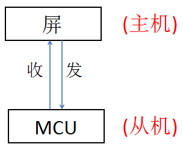
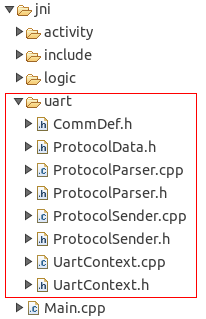
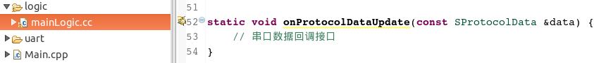

# Introduction to the serial port
The picture below is the simplest communication model; the screen and MCU communicate through the serial port, and they can interact with each other as long as the agreement is established.

There is something to note here. The traditional serial screens are used as slave devices and control them by sending corresponding instructions through the MCU; while our serial screens are different, our screens are logical, and they can interact by themselves. As the host side here.

If you develop this part of the communication code from scratch, the workload will be huge; in order to simplify the development process and enable developers to pay more attention to the development of business logic, our tool will automatically generate the serial communication code when building a new project. :  

At the same time, we also provide a callback interface for protocol data and interface interaction:   

Developers pay more attention to the display of data on the UI interface, and the communication part is automatically completed by our framework.
The protocol analysis part of the communication framework needs to be changed according to the communication protocol used by the developer.Next [Communication Framework Explanation](serial_framework.md) In this chapter, we will focus on the principle and the parts that need to be modified, and deepen our understanding of this communication framework through some cases in this chapter of [Communication Cases](serial_example.md)