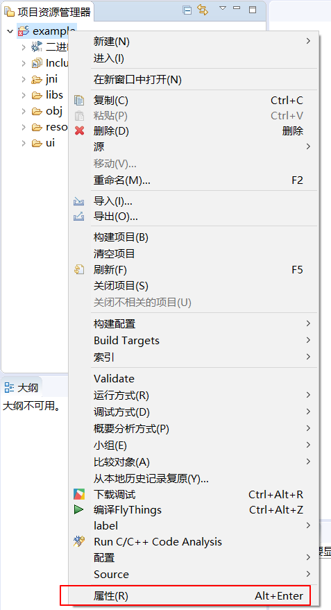
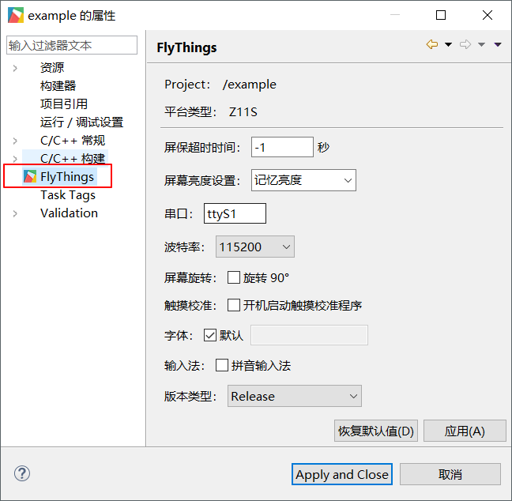

###  How to configure project properties

1. Select the project name to be configured in the project explorer  

2. Right click and select **Properties** option in the pop-up box 

     

3. Select the **FlyThings** option in the pop-up box. On the right side, you can see the property configuration of the current project. After confirming, click **Apply** to save the configuration.  

    

