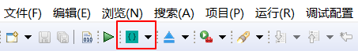
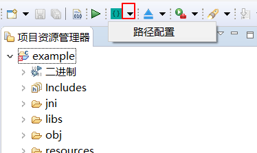
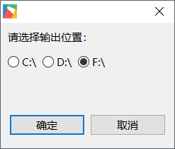
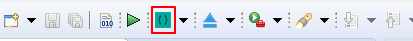

# Start the program from the TF card
When we cannot use ADB to download the program, we can also download the program to the TF card and start the program from the TF card.  
> [!Note]
> **Note: TF card only supports FAT32 format**

## Specific steps 
First we have to configure the output directory of the program.
1. Find this button on the toolbar  
     

2. Click the black drop-down arrow next to it, and select **Path Configuration** in the pop-up menu    

   

3. In the pop-up box, select the drive letter of the TF card (please ensure that the TF card can be used normally), and click OK.
  
    
 
4. In the above steps, we have configured the output directory, and now click the button in the figure below to start compiling, and it will package and output the compiled results to the configured drive letter.  

   

5. After the operation is successful, directories and files such as **EasyUI.cfg, ui, lib, and font** will be generated under the configured drive letter.  
6. Pull out the TF card, insert it into the machine, and power on the machine again. At this time, when the system detects the file in the TF card, it will start the program in the card instead of the program in the system.