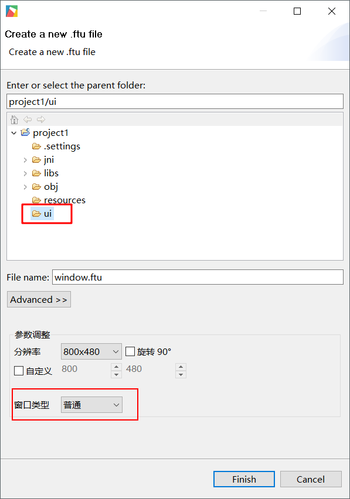
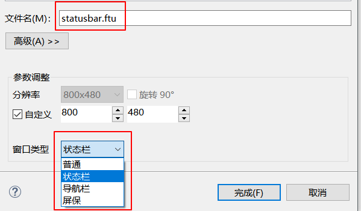

# 系统界面类型
前面介绍的应用界面我们归类为普通窗口界面，一般情况下已经够用了，通过工具新建UI界面时，默认的窗口类型就是普通窗口：  

 

如果某些场景需要一个悬浮在UI界面之上的显示区，那么普通窗口就不能胜任这份工作了，需要用到我们其他的几种类型的窗口了；
在 **窗口类型** 选项中，有三种特殊类型窗口选项，这三种特殊类型具有特殊的文件名，分别对应为
* 状态栏 **statusbar.ftu**
* 导航栏 **navibar.ftu**
* 屏保 **screensaver.ftu**  

  

点击确定后，工具会帮我们自动生成相应的代码；这三种类型的窗口，对于控件的操作与普通窗口一样；

## 状态栏
解释：这个状态栏跟Android，iOS手机的状态栏概念一致，是一个悬浮在UI界面之上的一个通用显示区。通常用于显示一些常见信息，或者放置返回键或Home键等等。如下效果：


系统提供了两个接口可以用于操作状态栏：

显示状态栏：
```c++
EASYUICONTEXT->showStatusBar();
```
隐藏状态栏：
```c++
EASYUICONTEXT->hideStatusBar();
```
完整源码见[**样例代码包**](demo_download.md#demo_download)中的**StatusBarDemo**工程

## 导航栏
解释：这个导航栏跟Android手机的导航栏概念一致，是一个悬浮在UI界面之上的一个通用操作或者显示区，一般在页面的底部。通常用于显示一些操作按键。导航栏实际上和状态栏没有什么差别。

显示导航栏：
```c++
EASYUICONTEXT->showNaviBar();
```
隐藏导航栏：
```c++
EASYUICONTEXT->hideNaviBar();
```

## 屏保应用
解释：屏保应用是指当用户不再做系统交互的时候，时间超过某个指定时间长度。系统自动打开一个页面。
右键工程, 选择 Properties 选项, 在弹出的属性框里，我们可以对屏保超时时间进行设置，单位为秒，-1表示不进屏保；
我们也可以通过代码进行一些设置，见 jni/include/entry/EasyUIContext.h：

* 所需头文件
 ```c++
 #include "entry/EasyUIContext.h"
 ```
 
* 设置屏保超时时间
```c++
//设置屏保超时时间为5秒
EASYUICONTEXT->setScreensaverTimeOut(5); 
```

* 设置是否允许启用屏保

  ```c++
  EASYUICONTEXT->setScreensaverEnable(false); //关闭屏保检测
  EASYUICONTEXT->setScreensaverEnable(true); //恢复屏保检测
  ```
  > 应用场景：如升级界面不能进入屏保模式，可以在升级应用里EASYUICONTEXT->setScreensaverEnable(false)关闭屏保检测。
  
* 立即进入屏保 
```c++
EASYUICONTEXT->screensaverOn();
```

* 立即退出屏保
```c++
EASYUICONTEXT->screensaverOff();
```

* 判断是否进入了屏保
```c++
EASYUICONTEXT->isScreensaverOn();
```

完整源码见[**样例代码包**](demo_download.md#demo_download)中的**ScreensaverDemo**工程
