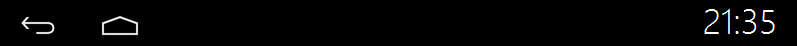

# System interface type
The application interface introduced above is classified as a normal window interface, which is usually enough. When creating a new UI interface through the tool, the default window type is a normal window:  

 

If some scenes require a display area floating above the UI interface, then ordinary windows will not be able to do the job, and we need to use several other types of windows;
In the **Window Type** option, there are three special types of window options, these three special types have special file names, respectively corresponding to
* Statusbar **statusbar.ftu**
* Navibar **navibar.ftu**
* Screensaver **screensaver.ftu**  

  

After clicking OK, the tool will automatically generate the corresponding code for us; the operations of these three types of windows are the same as those of ordinary windows;

## Status Bar
Explanation: This status bar is consistent with the concept of the status bar of Android and iOS phones. It is a general display area floating above the UI interface. Usually used to display some common information, or to place the return button or home button, etc. The following effects:  


The system provides two interfaces that can be used to operate the status bar:

Show status bar:
```c++
EASYUICONTEXT->showStatusBar();
```
Hide the status bar:
```c++
EASYUICONTEXT->hideStatusBar();
```
For the complete source code, see the **StatusBarDemo** project in the [**sample code package**](demo_download.md#demo_download)

## Navigation Bar
Explanation: This navigation bar has the same concept as the navigation bar of Android phones. It is a general operation or display area floating above the UI interface, generally at the bottom of the page. Usually used to display some operation keys. The navigation bar is actually no different from the status bar.

Show navigation bar:
```c++
EASYUICONTEXT->showNaviBar();
```
Hide the navigation bar:
```c++
EASYUICONTEXT->hideNaviBar();
```

## Screensaver application
Explanation: The screen saver application means that when the user no longer interacts with the system, the time exceeds a specified length of time. The system automatically opens a page.
Right-click the project, select the Properties option, in the pop-up properties box, we can set the screen saver timeout time, the unit is seconds, -1 means not enter the screen saver;
We can also make some settings through code, see jni/include/entry/EasyUIContext.h:

* Required header files
 ```c++
 #include "entry/EasyUIContext.h"
 ```
 
* Set the screen saver timeout period
```c++
//Set the screen saver timeout time to 5 seconds
EASYUICONTEXT->setScreensaverTimeOut(5); 
```

* Set whether to allow screen saver

  ```c++
  EASYUICONTEXT->setScreensaverEnable(false); //Turn off screensaver detection
  EASYUICONTEXT->setScreensaverEnable(true); //Restore screensaver detection
  ```
  > Application scenario: If the upgrade interface cannot enter the screen saver mode, you can turn off the screen saver detection in the upgrade application EASYUICONTEXT->setScreensaverEnable(false).
  
* Enter the screensaver now 
```c++
EASYUICONTEXT->screensaverOn();
```

* Exit the screensaver immediately
```c++
EASYUICONTEXT->screensaverOff();
```

* Determine whether to enter the screen saver
```c++
EASYUICONTEXT->isScreensaverOn();
```
For the complete source code, see the **ScreensaverDemo** project in the [**sample code package**](demo_download.md#demo_download)
