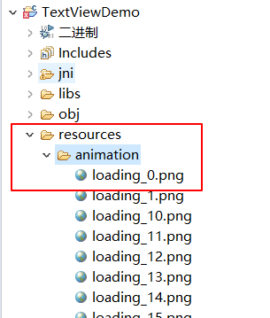

# 文本类 TextView

## 注意

如果不清楚如何修改文本的通用属性请参考[《通用属性》](ctrl_common#ctrl_common.md)

## <span id="add_textview">我需要显示一段文字/标签，怎么办？</span>
如果需要显示文字，利用现有的`Textview`件就可以快速实现。具体操作步骤如下：
1. 双击打开main.ftu文件
2. 在右侧控件集合中找到`文本`控件
3. 鼠标左键点击`文本`控件不放，然后将其拖拽到任意位置，松开左键，就能看到自动生成的文本控件。  

  


## 如何通过代码动态更新文本内容？
在串口屏的使用中，常常会动态更新文本内容。那么在代码中，我们可以通过`文本`控件对应的指针来动态更新文本控件的内容。具体操作步骤如下：
1. 首先需要知道文本控件在代码中对应的指针变量（[如果你不清楚指针变量名与UI文件中控件ID的对应规则，点击这里](named_rule.md)），这里以ID为`Textview1`的文本控件为例，它对应的指针变量为`mTextview1Ptr`，
2. 如果我们想要将Textview1控件的文本内容修改为`"Hello World"`,可以通过调用文本控件的成员方法`void setText(const char *text)`实现，在相应的`Logic.cc`文件中，具体代码为:
```c++
mTextview1Ptr->setText("Hello World");
```
结合实际的使用情况举例。
下面代码的作用是：当ID为Button1的按键被按下时，将ID为Textview1的文本设置为“Hello World”
```c++
static bool onButtonClick_Button1(ZKButton *pButton) {
    mTextview1Ptr->setText("Hello World");
    return false;
}
```
3. 文本控件除了可以设置字符串外，它还支持设置**数字**和**字符**：

```c++
/* 接口定义见头文件: include/control/ZKTextView.h */
void setText(int text);  // 设置数字
void setText(char text); // 设置字符

/* 操作样例 */
mTextview1Ptr->setText(123); // Textview1控件将显示"123"字符串
mTextview1Ptr->setText('c'); // Textview1控件将显示'c'字符
```


## <span id = "change_color">如何修改文字的颜色？</span>
默认的文本显示为白色，通常无法满足需求，那么可以通过以下两种方式来修改文本颜色。

### 在属性栏中直接修改控件的颜色

 在项目资源管理器中，选择一个UI文件，双击打开；
 在预览界面上，找到你要修改的控件，左键点击它，在编辑器的右侧就能看到该控件相应的属性表，这时候你就可以根据需要，填写自定义的属性值，就跟操作Excel一样, 找到你需要修改的属性，然后单击修改。

 在文本控件中，可以看到有3个表项与颜色属性有关，分别是
 * 颜色设置
    - 该属性可以分别设置控件各个状态下文字的颜色值
 * 背景色
     - 设置控件整个矩形区域的背景颜色（不会根据控件状态的变化而变化）
 * 背景颜色设置  
    - 对背景色属性的扩展，可以分别设置控件各个状态下的背景颜色

 具体示例：  

   

 效果图：

   

  上图是属性表颜色部分截图，其表示的含义为：背景颜色设置为黑色， 文字的颜色设置为白色，当控件设置为选中状态时，文字颜色变为红色。

### 通过代码控制颜色变化

   在属性表中设置颜色具有直观、方便的特点，但是缺少灵活性，于是在代码中，通过控件指针，调用相应成员方法可以对颜色进行动态控制。


  以ID为`Textview1`的文本控件为例，以下方法都可以达到修改颜色的目的。（[如果你不清楚指针变量名与UI文件中控件ID的对应规则，点击这里](named_rule.md)）

  以ID为`Textview1`的文本控件为例，以下方法都可以达到修改颜色的目的。


 * `void setInvalid(BOOL isInvalid)`  
    ```c++
      //将控件Textview1 设置为无效状态；如果属性表中`无效时颜色`属性不为空，则将其设置为指定的颜色，否则无变化。
      mTextview1Ptr->setInvalid(true);
    ```

 * `void setSelected(BOOL isSelected)`     
   ```c++
      //将控件Textview1 设置为选中状态；如果属性表中`选中时颜色`属性不为空，则将其设置为指定的颜色，否则无变化。
       mTextview1Ptr->setSelected(true);
   ```
 * `void setPressed(BOOL isPressed)`
   ```c++
      //将控件Textview1 设置为按下状态；如果属性表中`按下时颜色`属性不为空，则将其设置为指定的颜色，否则无变化。
       mTextview1Ptr->setPressed(true);
   ```
 * `void setTextColor(int color) //参数color以16进制表示RGB颜色`
   ```c++
      //将控件Textview1 设置为红色。
      mTextview1Ptr->setTextColor(0xFF0000);
   ```
   
## 如何显示小数
文本控件提供了设置string的接口。
```c++
	/**
	 * @brief 设置字符串文本
	 */
	void setText(const char *text);
```
如果你想显示任何数字，都可以先用 `snprintf` 这个函数，将数字格式化为字符串，然后设置字符串，从而达到随意显示内容的目的。    
例如：  
```c++
  float n = 3.1415;
  char buf[64] = {0};
  snprintf(buf, sizeof(buf), "%.3f", n); //固定显示3位小数，多余的小数位会忽略，不足则补0
  mTextView1Ptr->setText(buf);
```
`snprintf` 是一个C语言标准函数，你可以网上搜索相关资料了解，也可以查看这里的[简要介绍及使用例子](cpp_base.md#snprintf)。


## 实现逐帧动画
由于文本控件可以添加背景图，我们可以利用它简单的显示一张图片。  
更近一步，如果我们在代码中动态切换文本控件的背景图，只要切换的时间间隔足够短，那么就能实现动画的效果。

1. 图片资源准备  
  一段流畅的帧动画必然需要多张图片资源。这里我们已经准备好了，共60张。  
     

  可以看到每张图片表示一帧，并且根据序号统一命名，这主要是方便后续使用。    
  >**注意： 系统加载图片时将消耗较多资源， 为了界面运行流畅，强烈建议图片不宜过大。 比如例子中的单张图片大小仅为5KB左右**   

  将这些图片都拷贝到项目的 **resources** 目录下。你可以在 **resources** 目录下自行创建子文件夹，方便各种图片资源的整理归类。

  

2. 创建文本控件  
  在UI文件中任意创建一个文本控件。并将文本控件的背景图设置为其中一张图片。这里我将第一张图片设置为背景图。这一步仅仅是为了将文本控件的宽高自动调整为图片的宽高，你也可以选择不设置。  
  完整属性如图：  

      

3. 编译项目，注册定时器  
    添加了文本控件后，再次编译项目，在生成的`Logic.cc`文件中，注册一个定时器，时间间隔设置为 50 ms。 我们利用定时器每隔50ms切换一张图片。  
    [如何编译项目？](how_to_compile_flythings.md)  
    [如何注册定时器？](timer.md)
4. 动态切换文本控件的背景  
   在相应的`Logic.cc`文件中，添加如下切换背景图的函数， 并在定时器的触发函数 `bool onUI_Timer(int id)` 中调用它。   
   ```c++
   static void updateAnimation(){
        static int animationIndex = 0;
        char path[50] = {0};
        snprintf(path, sizeof(path), "animation/loading_%d.png", animationIndex);
        mTextviewAnimationPtr->setBackgroundPic(path);
        animationIndex = ++animationIndex % 60;
   }
   ```

    **上面的函数中有两点我们需要注意：**  
   * **切换文本控件的背景图是由 `setBackgroundPic(char* path)` 函数实现的。**
   * **`setBackgroundPic(char* path)`函数的参数是图片的相对路径。该路径是相对于项目中的 `resources` 文件夹而言。**  

      **例如：如下图，我们的图片是放在项目中 `resources/animation/` 文件夹下，那么 loading_0.png 这张图片的相对路径为  `animation/loading_0.png`**

       

     `setBackgroundPic(char* path)` 函数也可以接受绝对路径。例如：如果你将图片 `example.png` 放到TF的根目录下，那么它对应的绝对路径为 `/mnt/extsd/example.png`，  其中 `/mnt/extsd/`是TF卡的挂载目录。  
     我们推荐所有图片资源放到项目的 `resoources` 文件夹下，或者其子文件夹下，因为其他路径的图片资源将不会被自动打包到软件中。  

5. [下载运行](adb_debug.md)，查看效果    
6. [完整样例下载](#example_download)

## 特殊字符集的使用  
我们知道，根据asc码的定义，`字符 char` 与 `整形 int` 存在着对应关系。比如字符 `0` 的asc码为`48`。 特殊字符集就是将asc码映射为图片的一种功能。设置该功能后，当我们显示一个字符串时，系统会尝试将字符串中的每一个字符映射为指定的图片，最终显示一串图片到屏幕上。  
1. 设置方法   

     

   找到文本控件中的 **特殊字符集设置**， 点击右侧的 **更多**选项，将弹出特殊字符集选择框。  

     

   选择右上角的 **导入** 按键添加图片到字符集中， 添加图片后，你可以自行修改对应的asc码或者字符作为该图片的映射字符。然后点击 **保存**
2. 如果要验证特殊字集是否添加成功，你可以修改文字，预览图上会同步预览效果。   
   **注意：如果你设置了特殊字符集，那么系统会尝试将每个字符映射为字符集中指定的图片；如果某个字符没有设置图片的映射，那么这个字符将不会显示到屏幕上。**

### 具体使用
1. 在上面的特殊字符集设置框中，我们已经将字符 0-9 以及 : 冒号 分别映射为图片。  
   

   然后代码中，通过`setText(char* str)`函数设置字符串。由于我们在 TextTime 文本控件中设置了特殊字符集，所以字符都转变为了相应的图片。效果图如下：

   ```
   static void updateTime() {
     char timeStr[20];
     struct tm *t = TimeHelper::getDateTime()
     sprintf(timeStr, "%02d:%02", t->tm_hour, t->tm_min);
     mTextTimePtr->setText(timeStr);
   }
   ```
     

   如果你只需要显示单个字符，那么可以直接设置asc码或字符，不用转化为字符串。  
   例如：
   ```
   mTextTimePtr->setText((char)48); //直接设置asc码，需要转为char
   mTextTimePtr->setText('0'); //直接设置字符
   ```

## <span id = "example_download">样例代码</span>

由于文本控件属性较多，更多属性效果请参考[样例代码](demo_download.md#demo_download)中的TextViewDemo工程。   

预览效果图：


