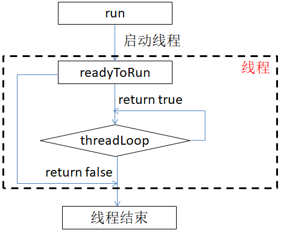
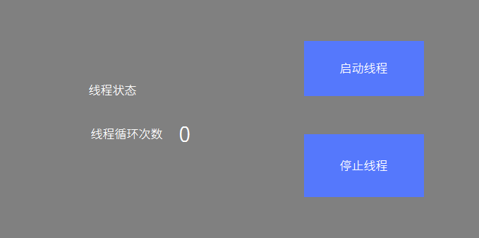

# Thread
The system supports `pthread` threads. If you know the `pthread` interface, you can also use the `posix` interface to implement threads.  
In addition, we also provide a wrapper class for `pthread`. This category includes the following three parts
* Thread.h：Thread class
* Mutex.h：Lock class
* Condition.h：Condition variable class

## Use of threads
1. Introduce the header file, inherit the `Thread` class, implement the `virtual bool threadLoop()` function, and choose to implement the readyToRun function as needed.

  ```c++
    #include <system/Thread.h>
    
    class MyThread: public Thread {
    public:
      /**
       * After the thread is created successfully, this function will be called, and some initialization operations can be done 
       in this function
       * return true   Continue thread
       *        false  Exit thread
       */
      virtual bool readyToRun() {
        LOGD("Thread Has been created");
        return true;
      }

      /**
       * Thread loop function
       *
       * return true  Continue thread loop
       *        false Launch thread
       */
      virtual bool threadLoop() {
        LOGD("Thread loop function");

        //Check if there is a request to exit the thread, if so, return false and exit the thread immediately
        if (exitPending()) {
          return false;
        }

        //Accumulate the count and display it on the screen
        loop_count += 1;
        mTextView2Ptr->setText(loop_count);

        //To facilitate observation, add sleep 500ms here
        usleep(1000 * 500);

        //Return true, continue the next thread loop
        return true;
      }
    };
  ```
  
2. Instantiate thread object
  ```c++
  static MyThread my_thread;
  ```
3. Start thread
  ```c++
    //The thread can be started by calling the run function of the thread class,  
    //The parameter is the thread name, which can be arbitrarily specified.
    my_thread.run("this is thread name");
  ```
4. Stop thread 
  The `Thread` class provides two functions for requesting to exit the thread. The difference between synchronous and asynchronous is used as follows:
  * **void requestExitAndWait()**  
    ```c++
    //Request to exit the thread, and wait until the thread completely exits, the function does not return
    my_thread.requestExitAndWait();
    ```
  * **void requestExit()**  
    ```c++
    /*Request to exit the thread, the function returns immediately after the request is sent, but at this time, it does not
       mean that the thread has also exited
    */
    my_thread.requestExit();
    ```
   
   After calling any of the above two functions, in the `threadLoop` function, we can use the `bool exitPending()` member function to determine whether there is a request to exit the thread.  
  ```c++
  virtual bool threadLoop() {
    LOGD("Thread loop function");

    //Check if there is a request to exit the thread, if so, return false and exit the thread immediately
    if (exitPending()) {
      return false;
    }
    return true;
   }
   ```
    
   > [!Note]
   > Note that the above function just adds a mark requesting to exit the thread, not forcibly terminating the thread.    
   > If you have been performing certain operations in the `threadLoop` function, and the `threadLoop` function has never been able to end, then the thread will not stop.  
   > The correct approach is to check the thread exit request in `threadLoop`, or check a termination condition, and then return `false`.
   
   ---
   > [!Warning]
   > It is forbidden to call the `requestExitAndWait` and `requestExit` functions in the `threadLoop` function, which may cause deadlock.  

5. Determine whether the thread is still running  
  ```c++
  if (my_thread.isRunning()) {
    mTextView4Ptr->setText("running");
  } else {
    mTextView4Ptr->setText("stopped");
  }
  ```

## Thread flow chart
After the explanation of the above steps, combined with the flowchart, you should have a deeper understanding.     


## Sample code  
See the `ThreadDemo` project in the [sample code](demo_download.md#demo_download)  
    


