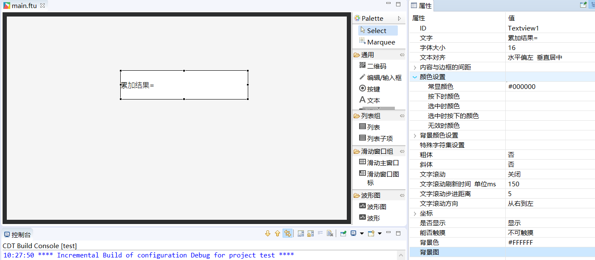
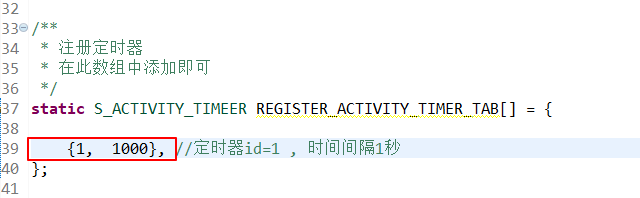
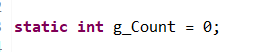
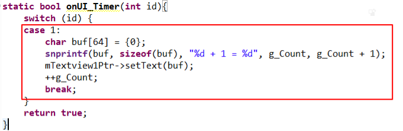
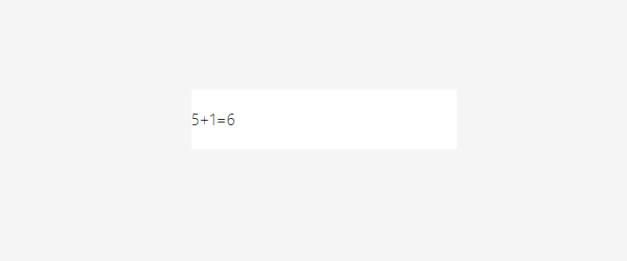

# <span id = "timer">Timer</span>
In some cases, we may need to do some operations regularly. For example, send heartbeat packets at regular intervals, regularly query data to refresh the UI interface, or do some polling tasks. If you have these requirements, then the timer is a convenient choice.
## How to use the timer
1. Register timer  
   For ease of use, we add a timer in the form of a filled structure.  
 In the Logic.cc file, there will be such a structure array by default:  
```c++
/**
 * Register timer
 * Just add to this array
 */
static S_ACTIVITY_TIMEER REGISTER_ACTIVITY_TIMER_TAB[] = {
	//{0,  6000}, //Timer id=0, time interval is 6 seconds
	//{1,  1000},
};
```
If we want to add a timer, we only need to add a structure to this array.  
The definition of this structure is as follows:
```c++
typedef struct {
	int id; // Timer ID, cannot be repeated
	int time; // Timer interval unit/ms
}S_ACTIVITY_TIMEER;
```
2. Add timer logic code  
   After registering the timer in the array, when a timer is triggered, the system will call the  `void onUI_Timer(int id)` function in the corresponding **Logic.cc** file. All operation codes for this timer are Added to this function, the function is specifically defined as follows: 
   ```c++
   /**
    * Timer trigger function
    * It is not recommended to write time-consuming operations in this function, otherwise it will affect UI refresh
    * @param id
    *         The id of the currently triggered timer is the same as the id at registration
    * @return true
    *             Keep running the current timer
    *         false
    *             Stop running the current timer
    */
   static bool onUI_Timer(int id){
	 switch (id) {

		default:
			break;
	 }
     return true;
   }
   ```
   This function is also generated by default with the **Logic.cc** file.    
   Pay attention to the parameters of the function **id** ，It is the same as the **id** value defined in the structure array, and we can judge which timer is currently triggered based on the **id** value, so as to do some targeted operations.

> [!Note]
> **Note: The timer of each interface is independent, and the id of the timer of different interfaces can be the same;<br/>Registered timer, as long as the interface is not destroyed（see [interface activity cycle](activity_life_cycle.md)）, Will always be running; <br/>No need to manually stop after registration, it will stop automatically when the interface is destroyed.**

##  Specific example  
Next, we will describe the use of timers with a specific example.  
Suppose we need to implement such a function: There is an integer variable, every second, the variable is accumulated by 1, and the latest result is displayed on the screen.  
The specific implementation process is as follows:
1. First, we add a text control to the UI file to display the accumulated result.    

      
2. Register the timer, add a structure to the timer array of **mainLogic.cc**, the timer id is 1, and the time interval is 1 second. Note that the time unit is milliseconds.

    
    
3. In **mainLogic.cc**, define a static integer variable and initialize it to 0   
    
      
4. In the `void onUI_Timer(int id)` function, add the accumulation code and display it in the text control.
    
    
5. Compile and run   
    
      

## Sample code  
 See the `TimerDemo` project in the [sample code](demo_download.md#demo_download)