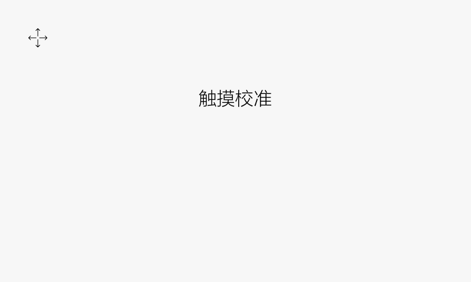
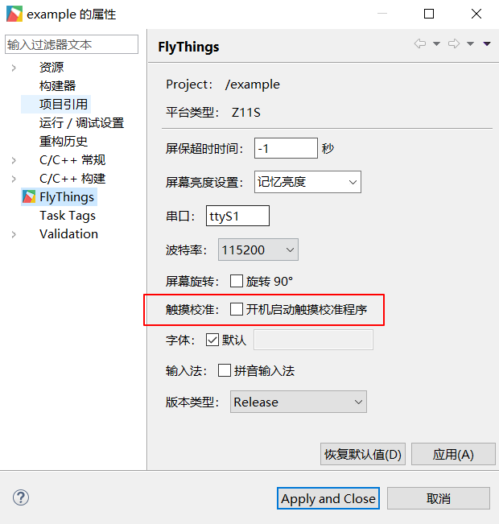
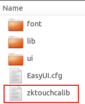

# Touch calibration
After the resistance screen machine is flashed, the system will perform a touch calibration the first time it is powered on. The calibration interface is as follows:



Click the "cross icon" to calibrate; we want to calibrate again later, we have the following 3 methods:
1. Modify the project properties through the tool, and check the **Start touch calibration program** option, so that each time the power is turned on, the touch calibration interface will be entered first:

     <br/>
2. Create a file **zktouchcalib** (note: the file does not have a suffix) in the root directory of the TF card , after inserting the card, it will enter the touch calibration interface

     <br/>
3. Start the touch calibration interface by code
```c++
EASYUICONTEXT->openActivity("TouchCalibrationActivity");
```
