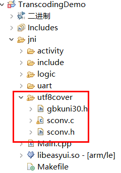

# UTF-8编码
目前系统内仅支持UTF-8编码，例如文本框等控件，也只能正常显示UTF-8编码的字符串。如果要正常显示其他的编码，需要自行转码。

## sconv
  sconv是一个转码的开源库，我们借助它来进行utf-8和gbk之间编码的转换。

## 准备
[下载sconv源文件](https://docs.flythings.cn/src/utf8cover.rar)，并将它解压到我们项目 `jni`文件夹下。   

  
  

## UTF-8 转 GBK
1. 引用头文件  
  ```c++
  #include <string>
  #include "utf8cover/sconv.h"
  ```

2. 添加函数  
  ```c++
  string utf8_to_gbk(const char* utf8_str) {
    int size = sconv_utf8_to_unicode(utf8_str, -1, NULL, 0);
    wchar *unicode = new wchar[size / 2 + 1];
    size = sconv_utf8_to_unicode(utf8_str, -1, unicode, size);
    unicode[size / 2] = 0;
  
    size = sconv_unicode_to_gbk(unicode, -1, NULL, 0);
    char *ansi_str = new char[size + 1];
    size = sconv_unicode_to_gbk(unicode, -1, ansi_str, size);
    ansi_str[size] = 0;
  
    string gbk(ansi_str, size);
    delete[] ansi_str;
    delete[] unicode;
    return gbk;
  }
  ```
3. 使用刚才的函数进行编码转换，例子如下：
 ```c++
   const char* utf8_str = "这是utf8编码";
   string gbk = utf8_to_gbk(utf8_str);
   LOGD("转换后，共%d字节", gbk.size());
   for (size_t i = 0; i < gbk.size(); ++i) {
     LOGD("第%d字节 = %02X", i, gbk.data()[i]);
   }
 ```


## GBK 转 UTF-8
1. 引用头文件  
  ```c++
  #include <string>
  #include "utf8cover/sconv.h"
  ```

2. 添加函数  
  ```c++
  string gbk_to_utf8(const char* gbk_str) {
    int size = sconv_gbk_to_unicode(gbk_str, -1, NULL, 0);
    wchar *unicode_str = new wchar[size / 2 + 1];
    size = sconv_gbk_to_unicode(gbk_str, -1, unicode_str, size);
    unicode_str[size / 2] = 0;
  
    size = sconv_unicode_to_utf8(unicode_str, -1, NULL, 0);
    char *utf8_str = new char[size + 1];
    size = sconv_unicode_to_utf8(unicode_str, -1, utf8_str, size);
    utf8_str[size] = 0;
    string utf8(utf8_str, size);
    delete[] unicode_str;
    delete[] utf8_str;
    return utf8;
  }
  ```
3. 使用刚才的函数进行编码转换，例子如下：
```c++
   //方便测试，这里构造一个gbk编码数组， 其内容为“这是gbk编码”
   const char gbk_str[] = {0xd5, 0xe2, 0xca, 0xc7, 0x67, 0x62, 0x6b, 0xb1, 0xe0, 0xc2, 0xeb,0};
   string utf8 = gbk_to_utf8(gbk_str);
   LOGD("转换后，共%d字节", utf8.size());
   LOGD("内容是：%s", utf8.c_str());
```