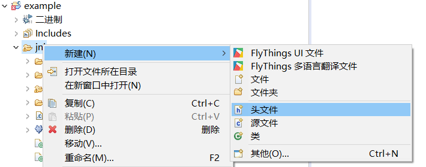
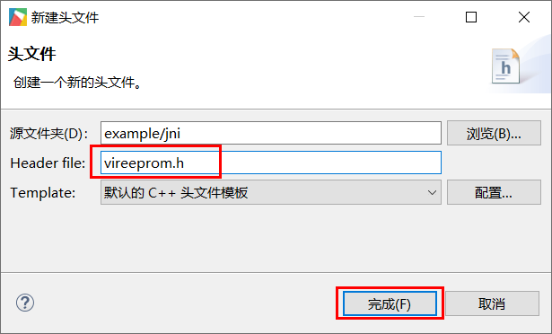

# Emulate EEPROM function

EEPROM (Electrically Erasable Programmable Read-Write Memory) is a user-changeable read-only memory (ROM), which can be erased and reprogrammed (rewritten) by a higher voltage than normal.
## Simulation principle
This system is based on Linux, with its own file system and balanced erasing algorithm. Write the saved data to **NorFlash**(Not less than 100,000 erasing and writing times, pay attention not **Nandfalsh**，**NandFlash** There are various risks after bad blocks appear).
FlyThings OS has reserved **/data** Partition, Used for user data, in order to facilitate the use of users who are familiar with the operation of the microcontroller,We create a file under the **/data** partition to simulate an EEPROM space.    (The size of the /data partition ranges from 1M or several hundred KB, depending on the specific system version)  
Does it feel particularly like the STC Dafa MCU that comes out of the domestic alchemy furnace?
## Scenes to be used
Save data after power failure.
## Implementation steps  
1. First create a header file in the **jni** directory of the project.

 Select **jni** under the project, click the right mouse button，Select the **header file** option in the pop-up context menu，Then name it  **vireeprom.h** and click Finish. 
   
     
     

2. Copy the following code completely into the header file just added. (When the header file was created just now, some content may be automatically added and deleted)

    These codes realize the emulation function of EEPROM.
    ```c++
    #ifndef JNI_VIREEPROM_H_
    #define JNI_VIREEPROM_H_

    #include <stdio.h>
    #include <string.h>
    #include <unistd.h>
    /**
     * The storage size of the simulated EEPROM, in bytes, it is recommended not to be too large
     */
    #define EEPROM_SIZE 1024
    /**
     * Actually saved as a file /data/eeprom.eep
     */
    #define EEPROM_FILE  "/data/eeprom.eep"

    class VirEEPROM {

    public:
      VirEEPROM() {
        memset(buff_, 0, sizeof(buff_));
        file_ = fopen(EEPROM_FILE, "rb+");
        if (file_) {
          fread(buff_, 1, EEPROM_SIZE, file_);
          fseek(file_, 0, SEEK_END);
          int f_size = ftell(file_);
          //Adjust the file to a suitable size
          if (f_size != sizeof(buff_)) {
            ftruncate(fileno(file_), sizeof(buff_));
            fseek(file_, 0, SEEK_SET);
            fwrite(buff_, 1, sizeof(buff_), file_);
            fflush(file_);
            sync();
          }
        } else {
          file_ = fopen(EEPROM_FILE, "wb+");
          //Adjust the file to a suitable size
          ftruncate(fileno(file_), sizeof(buff_));
        }
      }
      virtual ~VirEEPROM() {
        if (file_) {
          fflush(file_);
          fclose(file_);
          sync();
        }
      }
      /**
       * Return value: less than 0 is failure,greater than 0 is the actual number of bytes 
       written
       * Parameter: The data pointer that value needs to save, which can be a structure 
       pointer, char*, int*..., size is the size of the data to be saved
       * Examples of use:
       * const char buff[]="12345678";
       * VIREEPROM->WriteEEPROM(0,buff,sizeof(buff);
       */
      int Write(int addr, const void* value, int size) {
        if (file_ == NULL) {
          return -1;
        }
        if ((addr >= EEPROM_SIZE) || ((addr + size) > EEPROM_SIZE)) {
          //Oversize
          return -2;
        }
        memcpy(buff_ + addr, value, size);
        if (0 != fseek(file_, addr, SEEK_SET)) {
          return -3;
        }
        int n = fwrite((char*)value, 1, size, file_);
        fflush(file_);
        sync();
        return n;
      }
      /**
       * Return value: less than 0 is a failure, greater than 0 is the number of bytes 
       actually read
       * Parameter: the data pointer to be read by value, which can be a structure
       pointer, char*, int*..., size is the size of the data to be read
       *Application examples:
       * char buff[9];
       * VIREEPROM->ReadEEPROM(0,buff,sizeof(buff);
       */
      int Read(int addr,void* value,int size) {
        if (file_ == NULL) {
          return -1;
        }
        if ((addr >= EEPROM_SIZE) || ((addr + size) > EEPROM_SIZE)) {
          //Oversize
          return -2;
        }
        memcpy(value, buff_ + addr, size);
        return size;
      }
      /**
       * return value:
       *     0    success
       *    Less than 0 failed
       */
      int Erase() {
        if (file_ == NULL) {
          return -1;
        }
        if (0 != fseek(file_, 0, SEEK_SET)) {
          return -2;
        }
        memset(buff_, 0, sizeof(buff_));
        if (sizeof(buff_) != fwrite(buff_, 1, sizeof(buff_), file_)) {
          return -3;
        }
        fflush(file_);
        sync();
        return 0;
      }

      static VirEEPROM* getInstance() {
        static VirEEPROM singleton;
        return &singleton;
      }
    private:
      unsigned char buff_[EEPROM_SIZE];
      FILE* file_;
    };

    #define VIREEPROM  VirEEPROM::getInstance()

    #endif /* JNI_VIREEPROM_H_ */

    ```

3. So far the preparation work has been completed, we will write some examples to test whether it is normal.  
   Open the `mainLogic.cc` source file and quote the header file just now at the top of the file.
   ```c++
   #include "vireeprom.h"
   ```
   
   Test code  
   ```c++
   static void onUI_init(){
      //The value array, starting from address 0, is written sequentially
      char value[4] = {1, 2, 3, 4};
      VIREEPROM->Write(0, value, sizeof(value));

      //Start reading from address 0, read 4 bytes in sequence, and save the read content in buf
      char buf[4] = {0};
      VIREEPROM->Read(0, buf, sizeof(buf));
      //Output log
      LOGD("Data read: %02x, %02x, %02x, %02x", buf[0], buf[1], buf[2], buf[3]);
      
      //Clear all eeprom to 0
      VIREEPROM->Erase();
   }
   ```
   
   
   
   