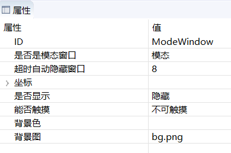

# 窗口
## 功能描述
窗口实际是一个容器部件。可以包含所有的控件，也可以再次包含一个新的窗口。可以用于以下场景
* 显示隐藏一个控件组合
* 当需要完成tab页面的时候可以通过多个窗口实现不同的窗口切换
* 弹出的对话框
* 弹出悬浮框

## 如何使用  
1. 创建一个 **窗口** 控件，默认的窗口是透明的。根据需求，可以自行添加背景图或者修改背景色；  你也可以将其他控件添加到窗口中。  

   
2. 在上面的属性表中 有两个属性需要解释下:  
  * **是否是模态窗口**  
    如果是模态，当这个窗口控件显示时，点击该窗口以外的区域，该窗口会自动隐藏。  
    如果是非模态， 该窗口控件的显示/隐藏 都必须自行控制。
  * 超时自动隐藏窗口  
    如果是模态窗口， 那么该窗口从刚开始显示开始计时，在指定时间后自动隐藏。单位为秒；如果该值为 -1，那么表示不会自动隐藏。  
    如果是非模态，那么该参数无任何作用。

## 代码操作  
对于窗口控件，我们一般会涉及到如下几个函数  
```
//显示窗口
void showWnd();
//隐藏窗口
void hideWnd();
判断窗口是否显示
bool isWndShow();
```

## 动态设置背景
如果我们将窗口布满整个屏幕，然后设置这个窗口的背景，即可实现修改屏幕背景的效果。

* 相关的接口
  ```c++
	/**
	 * @brief 设置背景图
	 * @param pPicPath 图片路径
	 */
	void setBackgroundPic(const char *pPicPath);

	/**
	 * @brief 设置背景颜色
	 * @param color -1时，背景设置为透明；其他颜色值为0x RGB，颜色值不支持alpha
	 */
	void setBackgroundColor(int color);
  ```

* 使用示例
  ```c++
	//把/mnt/extsd/bg.png 这个路径的图片设置为这个窗口控件的背景图
	mWindow1Ptr->setBackgroundPic("/mnt/extsd/bg.png");
	
	//将ID为window1的窗口背景色设置为红色
	mWindow1Ptr->setBackgroundColor(0xff0000);
    
    //将ID为window1的窗口背景色设置为绿色
	mWindow1Ptr->setBackgroundColor(0x00ff00);
        
    //将ID为window1的窗口背景色设置为蓝色
	mWindow1Ptr->setBackgroundColor(0x0000ff);
  ```

  有许多控件都拥有设置背景色、设置背景图的接口，使用方法相同。

# 样例代码
演示了 模态/非模态窗口控件的使用  

 

具体窗口控件的使用，参考[样例代码](demo_download.md#demo_download)中的WindowDemo项目  
