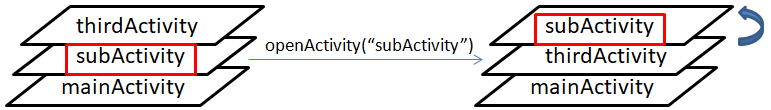

# 界面活动周期
在介绍界面的活动周期之前，我们先来了解一下界面的层级关系


首先我们的应用起来后会先进入**mainActivity**对应的界面，即启动界面，之后通过`openActivity`方法打开了**subActivity**对应的界面，接着再进入**thirdActivity**对应的界面，就形成了上图所看到的层级效果了；后打开的界面在层级上层，它们间形成了**栈**的这样一种关系；

## 打开界面时的活动流程
我们再来看看调用`openActivity`方法后，程序走了哪些流程，这里分两种情况介绍：
* 界面栈中**不存在**即将要打开的界面；


我们先来看一下**subLogic.cc**中的`onUI_init`函数，只有界面栈中不存在该界面情况下，第一次打开时，会走这个函数，走到这里意味着所有控件指针也就初始化完成了，在这个函数里我们就可以开始对它们进行一些操作，如下：
```c++
static void onUI_init() {
	//Tips :添加 UI初始化的显示代码到这里,如:mTextView1Ptr->setText("123");
	LOGD("sub onUI_init\n");
	mTextView1Ptr->setText("123");
}
```

界面打开时有数据传递过来，在`onUI_intent`回调函数中接收处理:
```c++
static void onUI_intent(const Intent *intentPtr) {
	LOGD("sub onUI_intent\n");
	// 判断不为空
	if (intentPtr) {
		// 键值解析
		std::string cmd = intentPtr->getExtra("cmd");		// "open"
		std::string value = intentPtr->getExtra("value");	// "ok"
		......
	}
}
```
界面显示完成回调`onUI_show`函数；

* 界面栈中**存在**即将要打开的界面；



这种情况只是将界面栈中对应的界面移动到顶层，不走~~`onUI_init`~~流程；


<br/><br/>
打开显示一个界面，意味着之前顶层的界面被隐藏掉了；假设在**mainActivity**界面打开了**subActivity**界面，它们的活动流程如下：


这里我们重点关注**mainActivity**界面**隐藏** ------> **subActivity**界面**显示**流程；

## 关闭界面时的活动流程
当我们调用`goBack()`函数时，会将顶层的界面弹出，直到启动界面；


关闭界面时会回调`onUI_quit`函数，如果界面打开后有申请一些什么资源的，记得要在这里进行释放；


退出顶层的界面后，会将下一层界面显示出来，即会回调下一层界面的`onUI_show`接口；<br/><br/>
当我们调用`goHome()`函数时，会直接回退到启动界面，将其他界面都弹出；


当我们调用`closeActivity("xxx")`函数时，可以移除除启动界面外任意界面；当移除的不是顶层的界面时，下一层的界面不会走~~`onUI_show`~~流程；