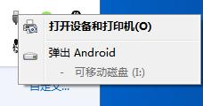
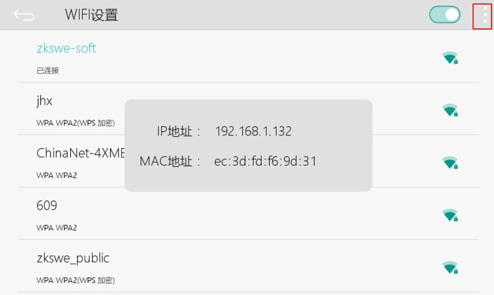
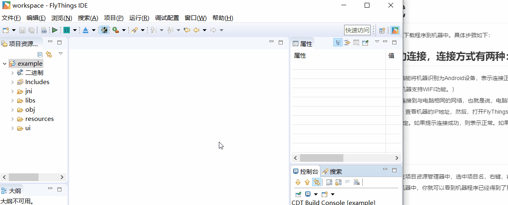
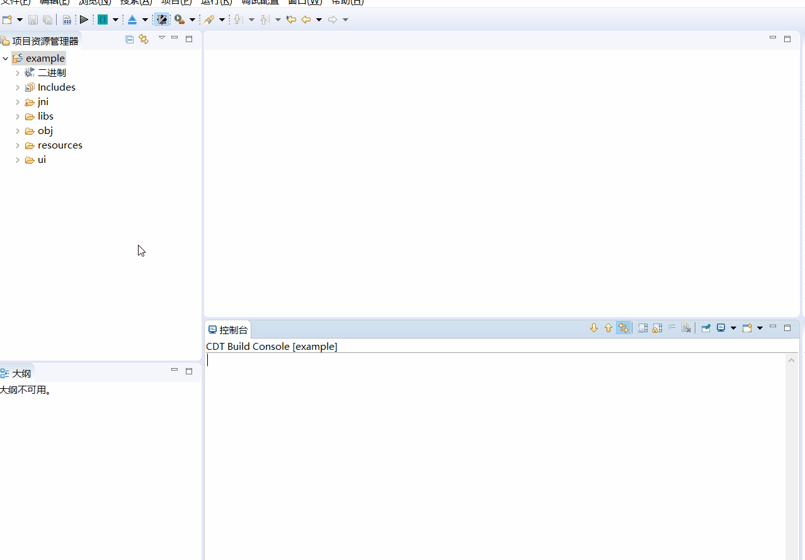

# ADB 快速下载调试
FlyThings 可以通过 USB线 或者WIFI 快速下载程序到机器中。具体步骤如下：   
## 首先确保电脑与机器成功连接，连接方式有两种：
> [!Note]
> ##### 注意： 如果您购买的是带有WIFI功能的版本，那么只能通过WIFI连接，USB线不能使用；
> ##### 以太网版本优先使用USB线连接，如果USB连接不成功才使用WIFI连接（即网络连接）方式，如果都不能成功连接请联系我们。
> ##### 同理，如果您购买的是不带WIFI功能的版本，那么只能通过USB线连接。
> ##### USB线连接成功可以看到

 1. 使用USB线连接电脑与机器。如果电脑能将机器识别为Android设备，表示连接正常。    如果不能正常连接，电脑提示驱动问题，可尝试[下载更新驱动](install_adb_driver.md)。
 2. 通过WIFI方式连接。（这种方式需要机器支持WIFI功能。）  
   先进入机器的[WIFI设置界面](wifi.md)，将机器连接到与电脑相同的网络，也就是说，电脑和机器必须接入同一个WIFI。（如果不同的网络会导致后续下载程序失败）。网络连接成功后，点击WIFI设置界面右上角菜单按钮查看机器的IP地址，然后，打开FlyThings IDE开发工具，在菜单栏上，依次选择菜单 **调试配置** -> **ADB IP配置**， 将机器IP填入，选择确定。工具将尝试与机器连接，如果提示连接成功，则表示正常。如果提示失败，则需要检查IP是否正确？机器连接WIFI是否正常？     

     WIFI设置界面  

      

    操作过程动画  

      

## 下载调试  
完成上一步后，就可以直接下载程序了。在项目资源管理器中，选中项目名，右键，在弹出菜单中选择 **下载调试** 菜单， 选择后，它会先自动编译一次，编译成功后，再将程序下载到机器中，如果没有提示错误，那么你就可以看到机器程序已经得到了更新。  
同样，在选中项目后，你还可以使用快捷键 **Ctrl + Alt + R** 下载调试。

[**查看打印日志**](logcat.md)

# 注意事项  
* 如果电脑上连接有Android手机，可能会与机器造成冲突，导致下载失败。使用时，建议暂时断开Android手机连接。
    * **注意 ： 通过该方式运行程序，并不能将程序固化到机器中，如果您拔掉TF卡或者断电重启，程序将自动恢复。 如果您希望固化程序到设备中，可以选择[制作升级镜像](make_image.md)，然后升级即可。**