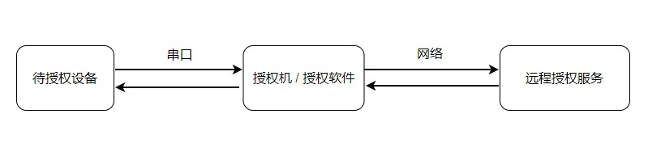

      
# Flythings 授权流程

## 系统要求
* 存在**KEY_CUST**分区，不小于1K
* 将UI进程放到后台运行，且保证串口终端正常可用。

## 操作步骤
目前支持两种授权方式：
1. 通过电脑的授权程序进行授权。
2. 通过独立的授权机进行授权。

### 通过Windows授权程序进行授权
1. 将待授权设备连接电脑串口。
2. 将待授权设备上电。
3. 在电脑上，[下载授权程序](http://download.flythings.cn/auth/FlyThingsAuth-1.1.3.zip)，解压缩到任意文件夹。
4. 运行`FlyThingsAuth.exe`，输入账号、密码，点击登录。
5. 成功登录后，选择对应的串口号，选择授权项目，然后点击`启动自动授权`。
6. 几秒钟后，程序窗口下方将显示`等待授权请求`、`授权中`、`授权成功`等提示信息。
7. 出现`授权成功`的提示信息后，即可断开设备，更换下一台设备继续进行授权。

### 通过授权机进行授权
1. 将待授权设备连接授权机任意串口。
2. 将待授权设备及授权机上电（注意授权机电压12V）。
4. 授权机依赖网络，需要接入一根以太网线。
5. 授权机开机后，会不断检测网络，网络正常后，提示输入账号、密码登录。
5. 成功登录后，点击`启动授权`。
6. 稍等片刻，授权机右侧将显示等待授权、授权中、授权成功等信息。
7. 出现`授权成功`的提示信息后，即可断开设备，更换下一台设备继续进行授权。

## 排查问题   
  
**问题：授权软件提示无法连接服务器**
      
该软件依赖网络，请检查电脑防火墙等设置，放开该软件的网络权限。

**问题：点击`启动授权` 后，一直显示`等待授权请求`提示信息，并且长时间等待后，也没有出现期望的`授权成功`提示信息。**

正常情况下，整个授权流程将在3秒内完成。如果出现以上现象，可大致分为三个原因：
1. 待授权设备已经授权，并且正常运行。
2. 待授权设备未正常运行。
3. 串口通讯异常。 

首先通过以下检查，分情况解决。
* 如果设备正常开机，并且UI显示正常，说明该设备已经授权，不会再发出授权请求，属于正常现象。
* 如果设备正常开机，并且屏幕左上角有`Powered by FlyThings`水印，说明该系统的ui库是体验版本，自行联系上游更换正式版本的ui库。
* 如果设备上电后，屏幕显示黑色背景，白色的 `www.zkswe.com` 文字，说明该设备未授权，同时，串口终端持续发出授权请求，  
 该情况下，属于串口通讯失败，应检查串口接线是否正确，然后检查串口硬件。
* 将设备的DEBUG串口连接电脑，如果终端持续重复输出 `uart authorize time out! `信息，说明该设备未授权，     
并且持续发出授权请求，该情况下，大致属于串口通讯失败，应检查授权机串口接线是否正确，然后检查串口硬件。
* 如果启用zkgui进程后，zkgui自动退出，并且终端日志中含有`ekey not match!`信息，说明该设备已有授权记录，但是校验失败。
这种情况，只能手动擦除KEY_CUST分区数据，然后重新授权。

