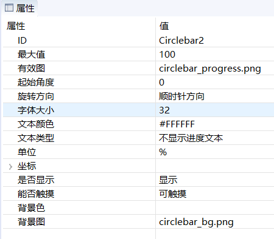
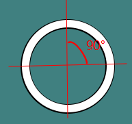
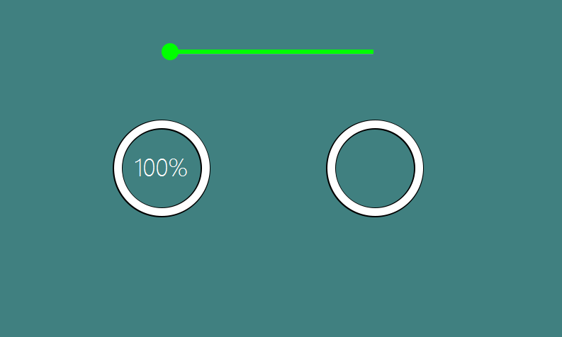

#  圆形进度条
某些情况下，我们需要显示一个 Loading 的加载动画。 那么圆形进度条这个控件就非常适合。

## 如何使用  
1. 首先，打开UI文件，创建一个 **圆形进图条** ，然后设置 **有效图** 属性。一个基本的圆形进度条就创建完成了。  
  它的所有属性如下：  

   

2. 圆形进度条实质是显示当前进度对应的扇形区域，这个区域是对 **有效图** 的裁剪得来。 举例：  
如果照上图属性设置， 最大值 100， 起始角度0， 旋转方向为 顺时针方向，那么当我们设置 25的进度时，仅显示右上角 90°的扇形区域。 如果进度值为100，那么就显示全部的有效图。  
> 注意： 这个扇形的显示区域只针对**有效图**进行裁剪， **背景图**不会被裁剪。

   

## 代码操作
圆形进度条提供的操作函数非常简单。    
```
//设置当前进度
void setProgress(int progress);
//得到当前进度值
int getProgress()；

//设置进度最大值
void setMax(int max);
//得到进度最大值
int getMax()；
```


# 样例代码
样例中， 滑动上方的滑动条，下方的两个圆形进度条进度会跟着变化。     
具体圆形进度条控件的使用，参考[样例代码](demo_download.md#demo_download)中的CircleBarDemo工程  

  
