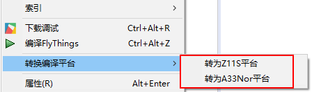

# 转换项目平台

为方便同一份项目源码用于不同硬件平台，提供了**转换编译平台**的功能。

操作步骤：
  1. 选中项目名，右键，在弹出的上下文菜单中，选择**转换编译平台**，即可快速切换平台。

  

# 针对转换功能，需要注意以下几点：
  1. 转换功能实质是重新配置了编译工具链等编译环境，并不会对源码有任何改动。
  2. 不同平台硬件有差异，所以串口、GPIO 等与硬件相关的设置需要您手动修改。
  3. 由于工具链版本差异，转换后可能出现编译失败的情况，这也需要手动修改Makefile或者规范源码解决。