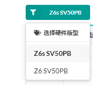
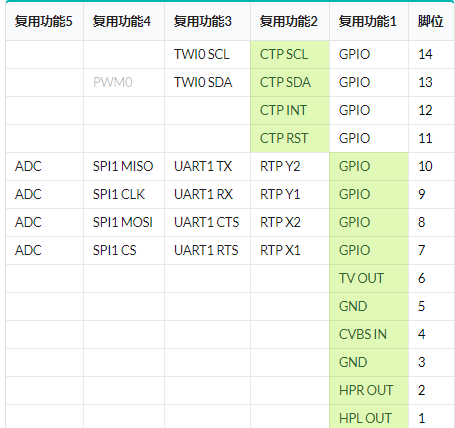
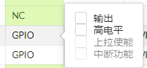

      
## 核心模组
  核心模组需要自行生成镜像，刷机，方可使用模组的多种功能。

## 使用教程
1. 注册并登录网址 [https://superv.flythings.cn](https://superv.flythings.cn/)

2. 选择硬件版型  
   
3. 选择每个脚位功能 
 
     
   
   
   
   > **注意**： 电容触摸PIN：CTPSCL、CTPSDA、CTPINT、CTPRST
电阻触摸PIN：RTPY2、RTPY1、RTPX2、RTPX1
4. 选择屏幕分辨率; 如果有需要，可再次调整屏幕参数

   
5. 选择触摸类型

   
   > **注意**： 触摸类型应该与PIN脚对应。 电容触摸PIN：CTPSCL、CTPSDA、CTPINT、CTPRST
电阻触摸PIN：RTPY2、RTPY1、RTPX2、RTPX1

6. 以上都设置完毕后，点击提交， 将根据配置下载新的系统镜像。 

  
7. 新的镜像下载完毕后，再参照[制作刷机卡教程](https://docs.flythings.cn/zh-hans/sd_boot)，对设备进行刷机。

8. 刷机成功后，可查看[FlyThings开发文档](https://docs.flythings.cn/)进行应用开发。

