# 通用属性
在开始介绍各个控件之前，我们先来基本的了解一下控件的一些通用的属性及设置接口；

## <span id = "widgetID">控件ID值</span>
ID值为控件的唯一标识，每一个ftu文件里的控件ID值是不允许重名的，不同的ftu文件里的控件ID值允许重名；设置ID值后，编译完会在**activity**目录下对应的头文件中生成相应的宏定义：

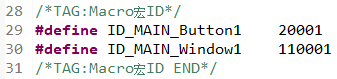

获取控件的ID值:
```c++
/**
 * 该接口定义于控件基类ZKBase中
 * 头文件位置： include/control/ZKBase.h
 *
 * 注意： 以下接口如未特殊说明，都表示定义在ZKBase类中
 * 所有控件直接或间接的继承了ZKBase类，所以，所有的控件都可以调用ZKBase类中public接口
 */
int getID() const;

/* 操作样例： 点击按钮控件，打印该控件ID值 */
static bool onButtonClick_Button1(ZKButton *pButton) {
    int id = pButton->getID();
    LOGD("onButtonClick_Button1 id %d\n", id);
    return false;
}
```

## 控件位置
我们打开任一ftu文件，选中任一控件，在属性框中，我们可以看到**坐标**这一属性，该属性确定了该控件的显示位置：


其中**左上角的坐标值**是相对于父控件左上角位置；<br/>
通过代码设置和获取控件的位置：
```c++
/* 接口说明 */
// 设置位置
void setPosition(const LayoutPosition &position);
// 获取位置
const LayoutPosition& getPosition();


/* 操作样例 */
// 点击按钮控件，设置该按钮位置
static bool onButtonClick_Button1(ZKButton *pButton) {
    // 左：0，上：0，宽：100，高：200
    LayoutPosition pos(0, 0, 100, 200);
    pButton->setPosition(pos);
    return false;
}

// 点击按钮控件，获取该按钮位置
static bool onButtonClick_Button2(ZKButton *pButton) {
    // pos的mLeft、mTop、mWidth、mHeight变量分别对应的就是坐标值
    LayoutPosition pos = pButton->getPosition();
    return false;
}
```

## 背景色


这个比较简单，修改一下颜色就可以看到效果了；<br/>
代码设置背景颜色：
```c++
/* color为-1时，背景设置为透明；其他颜色值为0x RGB，颜色值不支持alpha */
void setBackgroundColor(int color);


/* 操作样例： 点击按钮控件，设置背景颜色为红色 */
static bool onButtonClick_Button1(ZKButton *pButton) {
    pButton->setBackgroundColor(0xFF0000);
    return false;
}
```

## 背景图

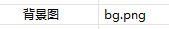

选择好图片后就可以看到效果了
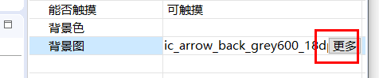

这里我们重点的来说明如何通过代码来设置背景图：
```c++
/**
 * pPicPath参数可以有以下两种方式：
 * 1. 绝对路径，如："/mnt/extsd/pic/bg.png"
 * 2. 相对资源目录路径，只需把图片放到项目工程resources目录下，编译打包后，就可以使用了，如resources目录下有bg.png图片，只需设置"bg.png"即可
 */
void setBackgroundPic(const char *pPicPath);


/* 操作样例 */
mButton1Ptr->setBackgroundPic("/mnt/extsd/pic/bg.png"); // 设置绝对路径
mButton1Ptr->setBackgroundPic("bg.png");    // 设置resources目录下bg.png图片
```

## 显示与隐藏


通过该属性，我们可以设置控件默认是显示还是隐藏状态；双击大纲视图中的控件可以快捷的修改该状态：

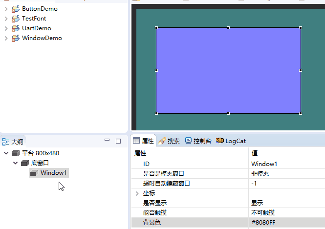

另外，我们还可以通过代码动态的设置控件显示和隐藏：
```c++
void setVisible(BOOL isVisible);
BOOL isVisible() const;

/* 操作样例 */
mButton1Ptr->setVisible(TRUE);  // 显示按钮控件
mButton1Ptr->setVisible(FALSE); // 隐藏按钮控件


/**
 * 窗口控件还可以使用下面的接口，功能一样
 * 头文件位置： include/window/ZKWindow.h
 */
void showWnd();  // 显示窗口
void hideWnd();  // 隐藏窗口
bool isWndShow() const;  // 窗口是否显示

/* 操作样例 */
mWindow1Ptr->showWnd();
mWindow1Ptr->hideWnd();
```

## 控件状态
对于**文本**、**按钮**、**列表子项**它们有5种状态，这里我们需要讲解一下：正常显示状态、按下状态、选中状态、选中按下状态、无效状态，设置完后会影响到控件对应状态的背景颜色、文本颜色及显示图片；

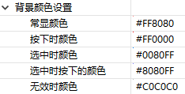

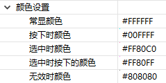

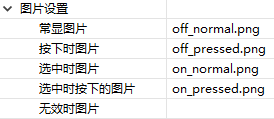

按下状态不需要通过代码设置，触摸控件即为按下状态；<br/>
选中状态和无效状态的代码操作接口：
```c++
// 设置选中状态
void setSelected(BOOL isSelected);
BOOL isSelected() const;

/* 操作样例 */
mButton1Ptr->setSelected(TRUE);
mButton1Ptr->setSelected(FALSE);


/**
 * 无效状态作用说明：控件设置为无效状态情况下，触摸控件没有作用，即不响应按下抬起事件
 */
// 设置无效状态
void setInvalid(BOOL isInvalid);
BOOL isInvalid() const;

/* 操作样例 */
mButton1Ptr->setInvalid(TRUE);
mButton1Ptr->setInvalid(FALSE);
```

## 样例说明

我们通过以下的小例子来了解通用属性的相关接口函数简单用法。

### 1.创建控件

首先，我们新建一个Flythings项目,双击打开项目UI文件夹下的main.ftu文件，在控件栏中分别拖出按键控件和文本控件。

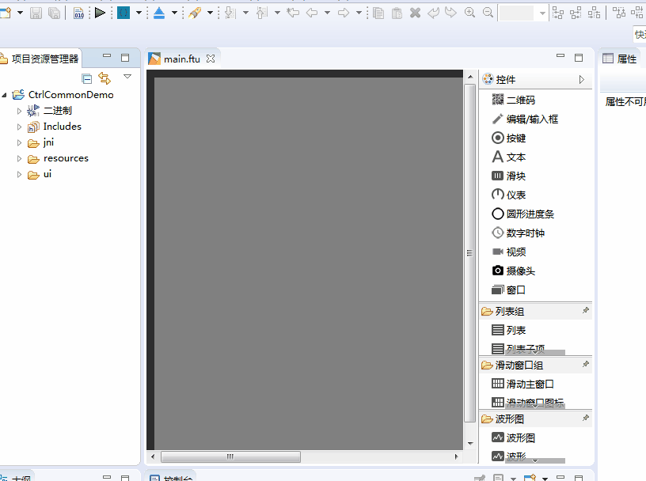


### 2.编译项目
(如不清楚具体操作请看[《如何编译FlyThings项目》](how_to_compile_flythings.md#how_to_compile_flythings)章节)

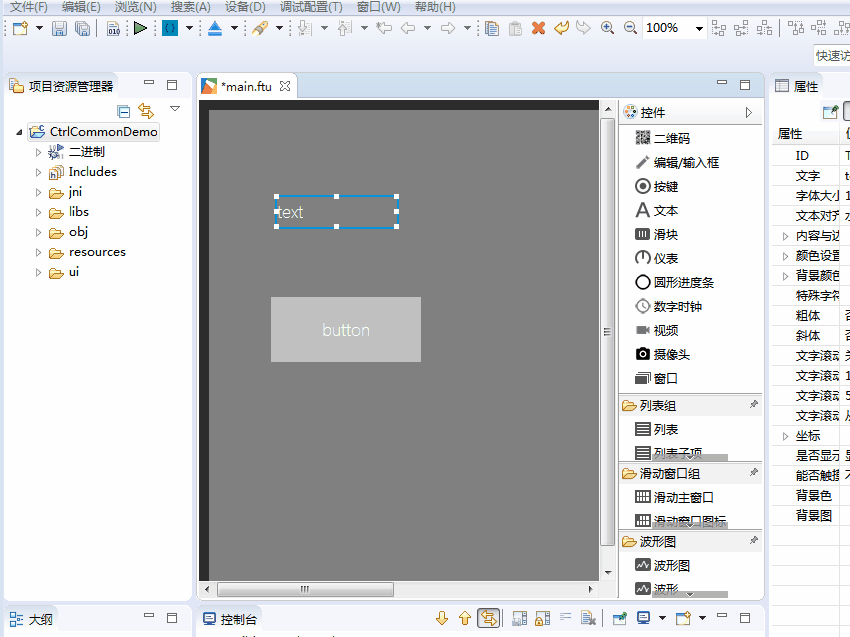

### 3.调用控件属性函数
编译完成后，打开项目中jni/logic/mainLogic.cc文件,可以看到文件最下方生成了`onButtonClick_Button1` 函数。
**我们将在该函数中调用getID()函数获取按键控件Button1的ID值，调用setText()函数在文本控件TextView1显示。**
([如果你不清楚指针变量名与UI文件中控件ID的对应规则，点击这里](named_rule.md))

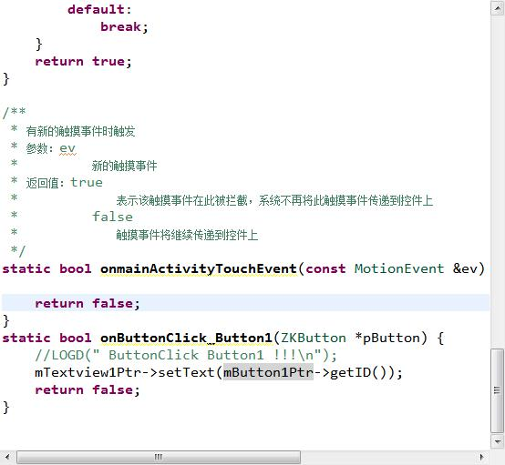

### 4.下载调试
在项目管理器中，选择项目名，右键点击后，在弹出菜单中选择**下载调试**即可将程序暂时下载到屏上运行。 运行后，点击按键即可看到[按键控件Button1的ID值](#widgetID)为20001.

### 注意：


<font color="#E6161E" size="4">想要了解更多控件通用属性的设置接口函数可以打开/jni/include/control/ZKBase.h文件，主要的属性设置接口函数都已注释。</font>
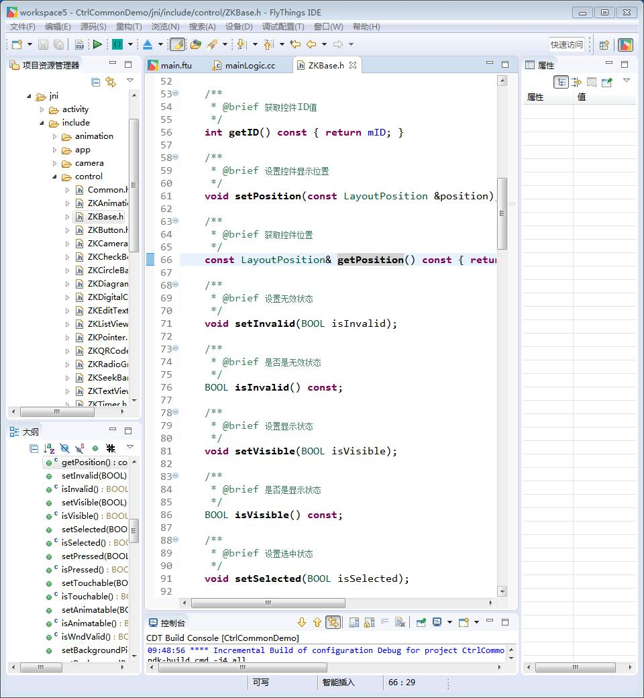
