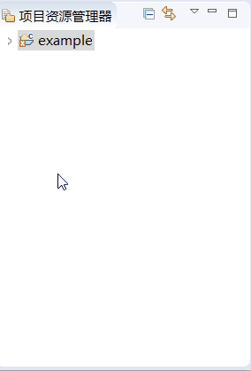
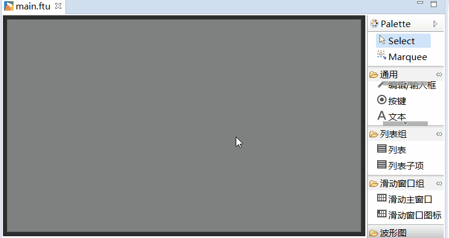
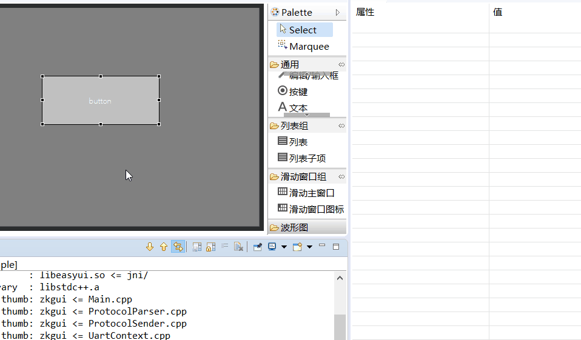
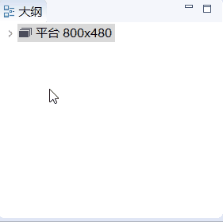
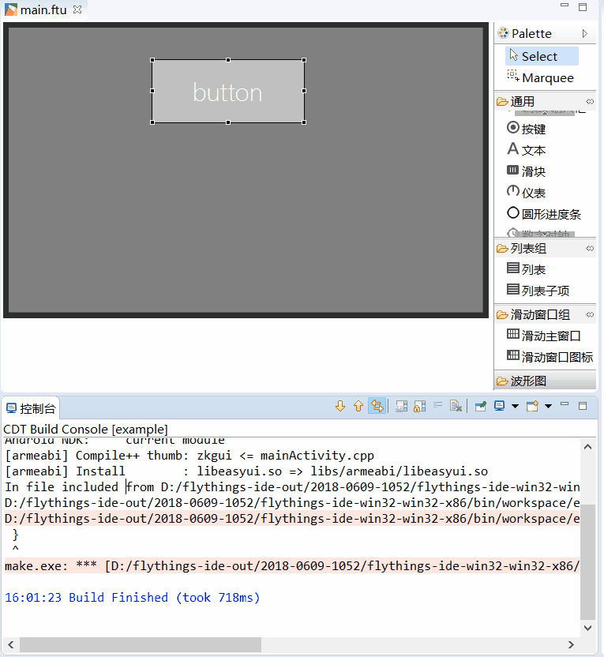

#  FlyThings IDE 工作区域使用介绍  
当你新建项目完成后，你将看到如下界面    
 
    
  
编辑器大致分为六个区域。分别的作用如下：  
  1. **① 区域 - 项目资源管理器** 它将项目文件夹内的资源文件、代码文件等以树形图的形式显示。你可以自由展开/收起，双击文件可以直接打开编辑。具体演示如下：  
  
        
 
  2. **② 区域 - UI编辑框**  主要负责UI界面的编辑和即时预览，他是开发中主要的操作区域
  3. **③ 区域 - 控件画板**  它包含了所有内置的控件，你可以点击选择需要的的控件，将其拖拽到 **②区域** 即可完成控件的创建。具体演示如下：   
  
       
    
  4. **④ 区域 - 属性表**  当你在 **区域②** 中选择了某个控件后，它的所有属性将在这里以表格的形式显示，你可以在表格中自定义修改。例如修改文字大小，具体演示如下：  
   
       
      
  5. **⑤ 区域 - 大纲视图** 它将已经创建的所有控件以树形图的形式展示；同样支持自由展开/收起； 可以清晰的了解控件之间的层级关系；并且可以直接拖拽某个节点，快速调整层级位置；双击节点可以快速显示/隐藏控件，这个在层级关系复杂后，非常好用。  具体演示如下：  
 
     
 
  6. **⑥ 区域 - 控制台** 编译代码时，这个位置将输出编译日志。如果编译失败，双击**错误提示内容**，可直接跳转到对应代码。  
 如下图，演示双击错误提示内容，直接跳转代码。  
 
     

有了以上的基础后，现在，我们可以正式开始开发。

