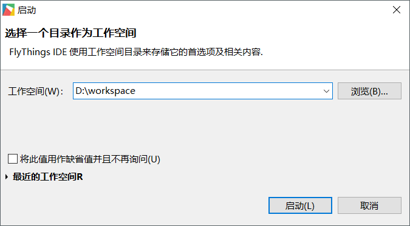
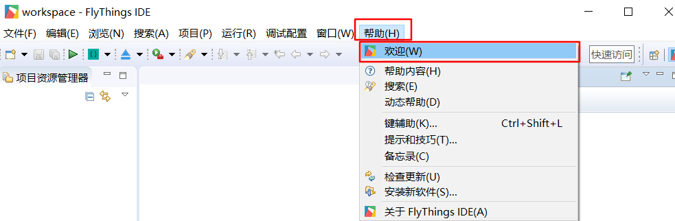

# 初次使用FlyThings 集成开发工具
如果你已经成功安装了[FlyThings IDE](download.md),那么在你的桌面上，找到  快捷方式，双击运行。  
如果你删除了快捷方式，你还可以在安装目录中的`bin`文件夹下，找到  直接运行。
## 选择工作空间
当你运行工具之后会弹出如下界面。  
* **工作空间** 用于存储相关设置及历史纪录，你可以将它理解为一个容器，它可以同时管理多个项目，这样不用同时运行多个开发工具。

   
## 欢迎界面
如果你第一次打开该软件，或者选择了一个新的工作空间，那么，你会看到下图这样的欢迎界面。
它提供了两个快捷功能： **新建项目** 和 **导入项目**      
  * **新建项目**  
    它会逐步引导你 [如何新建FlyThings项目](new_flythings_project.html)
  * **导入项目**  
    通过它，你可以将现有的项目导入到目前的工作空间，继续之前的开发。[如何导入项目](import_project.md)
    
      
    
 我们现在不着急 **新建项目** ，先在左上角选择 关闭欢迎界面。    
如果你想重新打开欢迎界面，在顶部 **菜单栏** 上，依次选择 **帮助 -> 欢迎** 菜单即可。     
 
   

    
