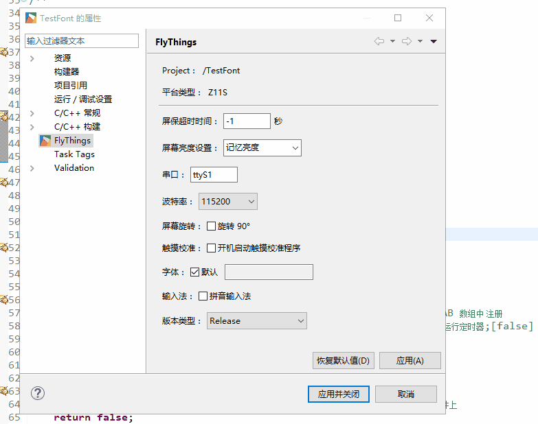

# 字体库设置
FlyThings系统默认打包的字体库是**思源黑体字体**，我们可以查看项目属性：

字体选项默认勾上，编译生成的升级文件就会打包工具安装目录下相应平台**font**目录下的**fzcircle.ttf**字体库

该字体库即为**思源黑体字体库**，我们做了些裁剪，改名为**fzcircle.ttf** ； 
如果我们想使用其他字体库，只需去除默认选项，导入新的字体库即可（**注意，这里字体库仅支持ttf格式**）：

**Z6S及以后平台**我们系统直接内置了**fzcircle.ttf**字体库，目的是为了加快开机速度，如果有字体缺失，我们需要自己定制一个扩展字体库，同为**思源黑体字体**，字体库名称也是**fzcircle.ttf**，导入方式同上，这样系统加载字体时优先加载系统内置的字体，加载失败则加载扩展字体库里对应的字体；如果是想使用其他字体库，导入的字体库名称不叫**~~fzcircle.ttf~~**即可，这样加载的字体就都是外部的字体。 

总结一下： 
**Z11S平台** ：因为该平台系统没有内置字体库，所以系统直接使用的就是工具打包出来的字体库，没有什么扩展字体库之分，记住，默认打包的就是**思源黑体字体 fzcircle.ttf**；  
**Z6S及以后平台** ：系统内置了**fzcircle.ttf**字体库，支持扩展字体库，同为**思源黑体字体**，字体库名称必须是**fzcircle.ttf**；使用其他字体库情况，导入的字体库名称不能是**~~fzcircle.ttf~~**；