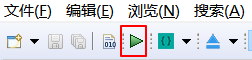

# 如何编译FlyThings项目
编译FlyThings项目十分简单。根据操作方式的不同，如下有三种方式可以编译。  
## 1.  从项目资源管理器选择编译   
具体步骤是： 在项目资源管理器中，左键选中需要编译的项目名，然后右键，在弹出菜单中，选择 **编译FlyThings** 选项即可自动编译该项目。  操作的动画如下：  

   
## 2. 通过工具栏选择编译  
在软件顶部的工具栏上有编译的快捷方式。 同样，先在项目资源管理器中，左键选中需要编译的项目名，然后再工具栏上找到  该绿色三角符号按钮，点击它，即可编译选中的项目。

## 3. 通过快捷键编译
你可能在上面的两个步骤中，已经注意到了编译的快捷键，也就是 **Ctrl + Alt + Z**，强烈推荐使用该方式编译。 在编辑了代码后，直接 **Ctrl + Alt + Z** 快速完成编译，十分方便。

# 如何清理项目
在项目编译过后，通常会留下些编译的目标文件和中间文件。比如 **libs** 和 **obj**文件夹 
，它们的存在是为了加快编译速度，达到增量编译。

  
你可以手动删除它们，或者通过菜单来自动清理。
* 手动删除  
 先选中需要删除的文件夹，右键，在弹出菜单中，选择 **删除** 选项。
 
  
 
* 自动清理  
如果总是手动执行删除，可能会造成误操作，造成重要文件的丢失。所以，利用自动清理，可以有效避免这种情况。
同样是先选中需要操作的项目名，右键，在弹出菜单中，选择 **清空项目** 选项。它会自动删除 **libs** 文件夹和 **obj** 文件夹里的编译中间文件。  
推荐使用此方式来清理文件。

**注意：如果编译时遇到奇怪的问题，或者遇到源码没有编译进程序的问题时，可以尝试先清理项目后，再重新编译。特别是当你导入他人的项目时，这种情况容易频发。**

# 如何重新编译
如果你想完全重新编译代码，那么你可以先清理项目后，再次编译即可

