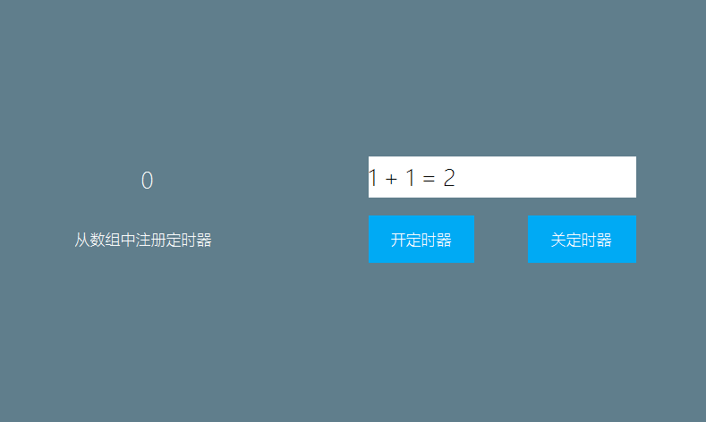

# 如何任意开启停止定时器
我们可以在`REGISTER_ACTIVITY_TIMER_TAB`中添加预设的定时器，但这种方式不够灵活，无法任意开启/停止，下面介绍另一种添加定时器的方法。
Activity类中有提供三个关于定时器的方法， 下面介绍如何使用。
```c++
/**
 * 注册定时器
 */
void registerUserTimer(int id, int time);
/**
 * 取消定时器
 */
void unregisterUserTimer(int id);
/**
 * 重置定时器
 */
void resetUserTimer(int id, int time);
```

1. 在logic.cc中，添加一个变量，标识该定时器是否已经注册。

    ```c++
     /**
      * 是否注册了定时器
      */
     static bool isRegistered = false;
     #define TIMER_HANDLE   2

    ```
2. 我们再添加两个按键，在按键的点击事件中，我们分别添加 注册定时器、取消定时器的代码。  

    ```c++

    static bool onButtonClick_ButtonTimerOn(ZKButton *pButton) {
        //如果没有注册才进行注册定时器
        if (!isRegistered) {
            mActivityPtr->registerUserTimer(TIMER_HANDLE, 500);
            isRegistered = true;
        }
        return false;
    }

    static bool onButtonClick_ButtonTimerOff(ZKButton *pButton) {
        //如果已经注册了定时器，则取消注册
        if (isRegistered) {
            mActivityPtr->unregisterUserTimer(TIMER_HANDLE);
            isRegistered = false;
        }
        return false;
    }

    ```

> [!Warning]
> 以上提到的 `registerUserTimer`、`unregisterUserTimer`、`resetUserTimer` 三个函数不能在 `onUI_Timer`函数中调用，会造成死锁。
 
## <span id = "example_download">样例代码</span>
参考[样例代码](demo_download.md#demo_download) 中TimerDemo项目。   
预览效果图： 


     