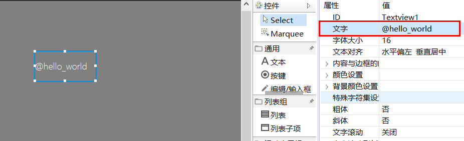

## 多国语言翻译
FlyThings 提供了多国语言翻译的功能，方便国际化。
### 如何添加翻译
1. 首先通过新建向导，创建翻译文件。
   
   
   
2. 创建完毕后，项目下会生成一个名为 **i18n** 的子文件夹，并且添加了默认的tr翻译文件。每个tr文件的文件名代表相应的语言 (请勿随意修改文件名)。
3. 双击打开tr文件，可以看出该内容为xml格式。每一个string标签表示一条翻译。**name** 属性用于给这条翻译取别名（建议统一为英文、数字、下划线组合命名），之后在代码中用别名代表该字符串。  
 > 注意：同一配置文件内，别名不能重复。  
 
     ```xml
    <?xml version="1.0" encoding="utf-8"?>
    <resources>
        <string name="hello_world">你好,世界!</string>
        <string name="hello_flythings">你好, FlyThings</string>
    </resources>
    ```
    如果希望在字符串中换行，则用`&#x000A;`转义，如下：
    ```xml
    <?xml version="1.0" encoding="utf-8"?>
    <resources>
        <string name="new_line_test">第一行&#x000A;第二行</string>
    </resources>
    ```
    
    如上所示，我们将 **“你好,世界!”** 这个字符串取别名为 `hello_world`、将 **你好, FlyThings** 这个字符串取别名为 `hello_flythings`，如果我们要添加更多的翻译，我们只需要按照示例添加`string`标签即可。
4. 既然是多国语言的翻译，我们就要为每个语言都添加相同 `name` 的标签。这样，当我们切换语言时，系统就会根据 `name` 属性，将内容替换。
5. 配置文件添加完毕后，我们就可以在ui文件以及代码中使用。  
6. 打开ui文件，我们可以在文本属性里输入 **@hello_world**  (我们用**@**符号后面跟上配置文件中的别名，来表示这个字符串需要翻译)。然后，我们下载运行，可以看到文本的内容已经自动翻译为 **你好，世界！**    

      
  
7. 我们还可以在代码中对字符串进行翻译。以前我们设置字符串是用 `setText()` 这个成员方法，如果我们需要自动翻译，则需要使用 `setTextTr()` 成员方法。 
例如:     
 ```c++
/**
 * 当界面构造时触发
 */
static void onUI_init() {
	// setTextTr 参数为翻译配置文件中的name值，注意：这里传入的字符串前面不需要带@符号
	mTextview1Ptr->setTextTr("hello_world");
}
 ```
 下载运行，我们可以看到内容已经替换为对应的字符串。

8. 我们还可以获取当前语言name对应的value值，然后做一些类似拼接的操作等等: 

```c++

#include "manager/LanguageManager.h"

static bool onButtonClick_Button1(ZKButton *pButton) {
    //LOGD(" ButtonClick Button1 !!!\n");
    std::string hello = LANGUAGEMANAGER->getValue("hello");
    std::string world = LANGUAGEMANAGER->getValue("world");
    std::string ret = hello + " " + world;
    LOGD("ret: %s\n", ret.c_str());
    return false;
}

```

## 支持更多的语言
默认只提供了四种语言（简体中文、英文、日文、韩文）。如果你需要支持更多的语言，可按照如下要求添加。  
 1. 拷贝现有的.tr文件，将文件名修改为 **xx_XX-XXX.tr** 格式，该格式分为三部分，第一个部分是语言代号，由两个小写字母组成；  
  第二个部分是地区代号，由两个大写字母组成；第三部分是语言的名字，这个名字将直接显示语言切换列表中。   
  如果不了解语言代号及地区代号，可以取任意字母组合，保证多个tr文件名的第一部分和第二部分不冲突即可。
  例子：  
  `es_ES-西班牙语.tr`  
  `fr_FR-法语.tr`  
  `ru_RU-俄语.tr`  
  `aa_BB-语言名称.tr`
  
 2. 添加tr文件后，按照之前的规则编辑tr文件即可。

### 如何切换语言
1. 系统默认的语言为 **zh_CN** （中文简体）。 
2. 你可以打开系统内置切换语言的界面选择语言。  
添加如下代码打开该界面。
```c++
EASYUICONTEXT->openActivity("LanguageSettingActivity");
```
或者使用如下API自由切换语言。

   ```c++
     EASYUICONTEXT->updateLocalesCode("zh_CN"); //设置为中文
     EASYUICONTEXT->updateLocalesCode("en_US"); //设置为英文
     EASYUICONTEXT->updateLocalesCode("ja_JP"); //设置为日语    
   ```   

### 字体要求        
   多语言翻译需要字体的支持。如果字体中不存在该文字，则会显示不正常，所以，字体中一定要包含多国语言的文字。
   > 系统默认字体是精简版本，建议添加自定义字体，参见[字体裁剪](font_cut_tool.md)。

### 样例  
完整源码见[**样例代码包**](demo_download.md#demo_download)中的**TranslationDemo**工程


