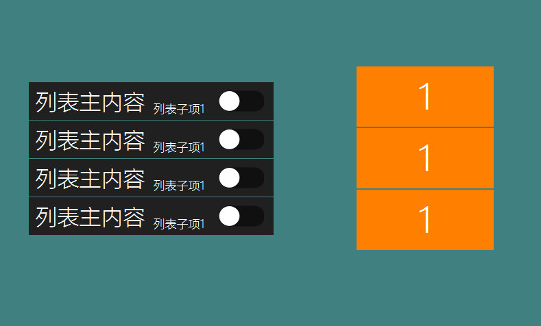

# 列表控件
## 功能
列表按键经常用于一个页面无法展示完成所有信息的时候使用，同时每个单元信息中存在一些一致的属性分类

## 场景
WiFi列表，设备列表，表格信息

## 具体如何使用
1. 打开UI文件，创建一个列表控件,再添加两个列表子项控件到列表中 然后你就能直观的看到列表的外观样式。 具体操作如下：  

   
2. 选中列表，可以看到它有如下属性   
    

 每项属性你可以尝试修改，然后下载程序到机器中查看具体变化。  
3. 现在转到大纲视图    

   

 可以看到列表下默认生成了一个 **Item**节点，它表示列表的一行或者一列， 在**Item**里包含我们添加的两个 **ListSub** 节点。  
 你可以点击选中各个节点，查看它们各自的属性，以及在预览图上可以看到它们作用的范围。  
 **注意：每一个列表控件最多可以添加 32 个列表子项。**

 **Item** 和 **列表子项** 控件的属性与 **按键**控件类似。
 你可以分别修改它们的属性，调整样式。我这边修改后的结果如下：  

   
4. 在UI文件中调整好列表的大致外观后，再进行编译[(如何编译FlyThings项目)](how_to_compile_flythings.md#how_to_compile_flythings)。在自动生成的关联函数中，我们要添加具体的逻辑代码，绘制列表的具体内容。
5. 编译后，在对应的Logic.cc源文件中，每一个列表控件会生成三个与之相关的函数。
  *  `int getListItemCount_ListView1()`： 获取将要绘制列表的长度  
        例如: 要显示的数据有100条， 那么就返回100。
  *  `void obtainListItemData_List1`： 具体设置列表每一项的显示内容
     具体例子参见后续文档
  以上两个函数共同控制着列表的显示内容。更具体的函数调用流程。
  *  `onListItemClick_List1`： 列表控件的点击事件
    当点击列表中的某一项时，系统会调用该函数，参数index 表示 当前被点击列表项的索引值。  

## 列表绘制的流程
  1. 当我们要绘制一个列表时，首先系统需要知道它一共有多少项，所以，我们提供了`int getListItemCount_ListView1()`这个函数，它会被系统调用，用于获取列表的长度（总项数），注意，该函数是动态获取的，在程序的运行过程中，我们可以根据业务需要，返回不同值，就可以动态控制列表的长度。   
  2. 接着，系统会多次调用`void obtainListItemData_ListView1(ZKListView *pListView,ZKListView::ZKListItem *pListItem, int index)`该函数，每一次调用，我们可以在该函数中，利用参数提供的指针，详细控制每一项具体显示的内容。  
    * **例子1.  设置列表项的显示内容**
    ```c++
    static void obtainListItemData_ListView1(ZKListView *pListView,ZKListView::ZKListItem *pListItem, int index) {
	    //pListItem指针表示列表项， 该指针只能在这个函数内当中使用
        char buf[32] = {0};
	    //参数index表示 当前绘制的是列表的第几项，从0开始。
	    //这里，我们将index值格式化到字符串中
	    snprintf(buf, sizeof(buf), "第%d项", index);
	    //将字符串作为文字显示到列表项区域
	    pListItem->setText(buf);
        //如果你在ui文件中，已经配置好了 列表项 "选中时的图片“，
        //那么，通过以下这行代码设置列表项的选中状态，即可控制列表项显示对应状态的图片
	    pListItem->setSelected(true);
    }
    ```
    * **例子2. 设置列表子项的显示内容**  
    如果我们用到了列表子项，可以通过如下方法得到列表子项的指针，再通过新得到的指针操作列表子项。  
    ```c++
    static void obtainListItemData_ListView1(ZKListView *pListView,ZKListView::ZKListItem *pListItem, int index) {
        char buf[32] = {0};
        //参数index表示 当前绘制的是列表的第几项，从0开始。
        //这里，我们将index值格式化到字符串中
        snprintf(buf, sizeof(buf), "第%d项的第一个子项", index);
        //我们可以通过findSubItemByID()函数以及列表子项的ID，得到列表子项的指针
        //与pListItem指针相同，查找得到的列表子项指针也只能在这个函数内当中使用
        ZKListView::ZKListSubItem* subitem1 = pListItem->findSubItemByID(ID_MAIN_SubItem1);
        if (subitem1 != NULL) {
            //设置列表子项1的文字
            subitem1->setText(buf);
        }

        snprintf(buf, sizeof(buf), "第%d项的第二个子项", index);
        ZKListView::ZKListSubItem* subitem2 = pListItem->findSubItemByID(ID_MAIN_SubItem2);
        if (subitem2 != NULL) {
            //设置列表子项2的文字
            subitem2->setText(buf);
        }
    }
    ```

## 列表的思想
 在我们的系统中，列表是对一系列规则数据的映射，如果我们想修改列表，比如增加一项数据，或者修改某项内容等，应先修改数据，再触发刷新，
 然后系统会自动调用`obtainListItemData_ListView1`函数，在该函数中，再根据最新的数据设置列表的显示内容。  
 这个思想在下面的样例中就有体现。

## 样例代码
   我们提供了列表控件样例，参考[样例代码](demo_download.md#demo_download)中的ListViewDemo工程。    
### 样例讲解
1. 创建列表控件
我们依次创建两个列表控件，尝试设置不同的属性及外观。
**CycleList控件：** 开启循环列表选项

  

2. 编译项目
这一步会自动生成列表相关的代码到相应 **Logic.cc** 文件中。  
具体操作参考[《如何编译FlyThings项目》](how_to_compile_flythings.md#how_to_compile_flythings)

3. 创建List1列表需要的数据结构体  
一般情况，我们会定义一个结构体来作为列表每项数据的模型  
```c++
typedef struct {
    //列表项显示的文字
	const char* mainText;
    //列表子项1要显示的文字
	const char* subText;
    //打开/关闭 标识
	bool bOn;
} S_TEST_DATA;
```
我们再定义一个该结构体数组，用于模拟列表数据  
```c++
static S_TEST_DATA sDataTestTab[] = {
	{ "测试数据1", "testsub1", false },
	{ "测试内容2", "testsub2", false },
	{ "测试数据3", "testsub3", false },
	{ "测试测试4", "testsub4", true },
	{ "测试数据5", "testsub5", false },
	{ "测试数据6", "testsub6", true },
	{ "测试数据7", "testsub7", false },
	{ "测试数据8", "testsub8", false },
	{ "测试数据9", "testsub9", false },
	{ "测试数据10", "testsub10", false },
	{ "测试数据11", "testsub11", false }
};
```

4. 添加列表函数代码  
  ```c++
  static int getListItemCount_List1(const ZKListView *pListView) {
      //以数组的长度作为列表的长度
      return sizeof(sDataTestTab) / sizeof(S_TEST_DATA);
  }

  static void obtainListItemData_List1(ZKListView *pListView,ZKListView::ZKListItem *pListItem, int index) {
      //得到列表子项1的指针，命名为psubText
      ZKListView::ZKListSubItem* psubText = pListItem->findSubItemByID(ID_MAIN_ListSub1);
      //得到列表子项2的指针，命名为psubButton
      ZKListView::ZKListSubItem* psubButton = pListItem->findSubItemByID(ID_MAIN_ListSub2);
      pListItem->setText(sDataTestTab[index].mainText);
      //以index为下标，从数组中得到对应的结构体，在从结构体中得到需要显示的文字，最后设置到对应的列表子项中
      psubText->setText(sDataTestTab[index].subText);
      //UI文件中，我们为列表子项2设置了选中时的图片属性，
      //这里根据结构体的`bOn`值，设置列表子项的选中状态，这样如果成员`bOn`为真，则设置为选中，系统会自动显示之前设置好的选中图片
      psubButton->setSelected(sDataTestTab[index].bOn);
  }

  static void onListItemClick_List1(ZKListView *pListView, int index, int id) {
      //当点击列表的第index项时，修改bOn变量， 将bOn取反。这样做可达到每点击列表一下，图片就切换一次
      //注意图片切换的操作是在obtainListItemData_List1 函数中完成的，现在我们只修改这个变量值而已
      sDataTestTab[index].bOn = !sDataTestTab[index].bOn;
      //上一句代码修改了结构体数据，现在我们想立即刷新列表，调用了refreshListView 强制刷新
      //触发刷新后，系统会再次调用getListItemCount_List1 和obtainListItemData_List1 两个函数， 这样修改后的数据就与列表显示对应了。
      mList1Ptr->refreshListView();
  }
  ```
5. 添加完代码后可运行查看实际效果。
