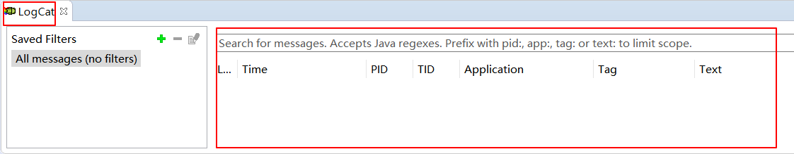
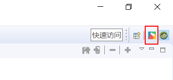

# 查看日志
## 添加日志
* 所需头文件  
  ```c++
  #include "utils/Log.h"
  ```
  FlyThings 的打印统一调用 `LOGD` 或 `LOGE` 宏输出，使用方法与C语言的`printf`相同 ; 默认生成的代码里就有调用的例子（默认被注释掉，需要时打开）：

    ```c++
    static bool onButtonClick_Button1(ZKButton *pButton) {
        LOGD("onButtonClick_Button1\n");
        return true;
    }
    ```

## 查看打印

 连接好 [ADB](adb_debug.md) 后，可以通过我们的工具查看程序的打印日志。 具体操作步骤如下：

  1. 在菜单栏上 选择 **调试配置** -> **切换日志窗口** ，工具会切换到另一个界面。
 
   

  2. 在新界面的左下角，选中 **LogCat** , 如果连接正常，在右侧红框区域，你将看到机器的打印日志。

   
 
   如果你想回到代码编辑界面， 在工具的右上角，点击 **FlyThings**的图标即可。
     
