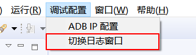

# 查看日志
## 添加日志
* 所需头文件  
  ```c++
  #include "utils/Log.h"
  ```
  FlyThings 的打印统一调用 `LOGD` 或 `LOGE` 宏输出，使用方法与C语言的`printf`相同 ; 默认生成的代码里就有调用的例子（默认被注释掉，需要时打开）：

    ```c++
    static bool onButtonClick_Button1(ZKButton *pButton) {
        LOGD("onButtonClick_Button1\n");
        return true;
    }
    ```

## 查看打印日志

### 命令行的方式查看（推荐）
1. 找到软件的顶部菜单， 依次打开菜单 `调试配置`->`打开系统命令行`
2. 如果你是采用USB线与设备连接， 直接在命令行中输入 `adb shell logcat -v time` 再输入回车键，如果电脑与设备连接正常，将看到设备的所有日志信息。  
  如果你是采用的网络连接，例如WIFI、以太网， 那就得先查看设备，得到设备的IP地址，再在命令行里输入 `adb connect 192.168.1.123` （此处自行更换IP地址），再输入回车键，如果IP正确，正常连接，将看到这样的信息： `connected to 192.168.1.123:5555` ，  
  正常连接后，再输入 `adb shell logcat -v time` ，再输入回车键，就可以看到所有的日志信息了。
3. 可以通过 `Ctrl + C`组合键停止日志显示。
4. 如果想查看简单版的日志 ，可以输入 `adb shell logcat`，再输入回车键，此时输出的日志将不会包含时间信息。  
5. 日志系统带有缓存，如果想清空系统缓存的日志，可以输入`adb logcat -c`。

### UI界面的方式查看 (弃用)
 连接好 [ADB](adb_debug.md) 后，可以通过我们的工具查看程序的打印日志。 具体操作步骤如下：

  1. 在菜单栏上 选择 `调试配置` -> `切换日志窗口` ，工具会切换到另一个界面。
 
   

  2. 在新界面的左下角，选中 **LogCat** , 如果连接正常，在右侧红框区域，你将看到机器的打印日志。

   
 
   如果你想回到代码编辑界面， 在工具的右上角，点击 **FlyThings**的图标即可。
     
