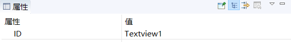
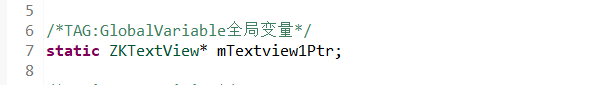
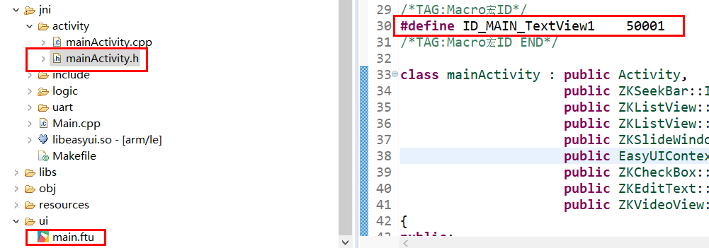
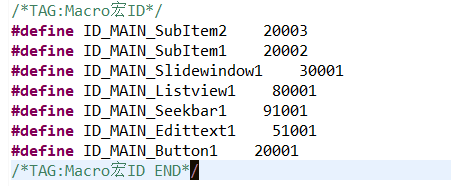
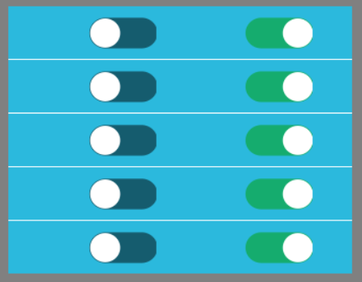

# 控件的命名规则
我们在UI文件中添加的大部分控件，经过编译后，都会自动生成一个对应的指针变量以及一个宏定义整型值。
## <span id="id_name_rule">控件ID名称与指针变量名的命名规则</span>

指针变量名由三部分构成。
分别为固定的小写 **m** 作为前缀 + **ID**名 + **Ptr** 作为结尾  
以ID属性为 **Textview1** 的控件为例  

 
 
编译后，生成的对应的指针变量名为  **`mTextview1Ptr`**  

  

指针变量的类型根据控件类型而定。 各个控件对应指针类型如下：   
各个类的头文件都可在项目 **jni/include** 文件夹下找到。

| 控件名 | 类名 
|:--------:|:-------:
|    | ZKQRCode  | 
|    | ZKEditText   |
|    | ZKButton    |
|     | ZKTextView   |
|    | ZKSeekBar   | 
|    | ZKPointer   | 
|    | ZKCircleBar   | 
|    | ZKDigitalClock   | 
|    | ZKVideoView   | 
|    | ZKCameraView   | 
|  | ZKWindow |
|  | ZKListView |
|   | ZKSlideWindow |
|   | ZKDiagram |

## <span id="id_macro_rule">控件ID名称与宏定义整型值的命名规则</span>
该宏定义表示 UI文件中控件的映射关系。
该宏定义由三部分构成。分别为固定的大写 `ID` 、大写的UI文件名、控件ID属性名称构成。  
以ID属性为 **Textview1** 的控件为例  

 
 
编译后，生成的对应的宏语句为  ** `#define ID_MAIN_TextView1    50001` **  



> [!Warning]
> 请勿随意更改宏定义的整型值，否则会造成程序异常。

## <span id = "relation_function">控件自动生成的关联函数讲解</span>
有些控件会自动生成关联函数。这些控件生成的关联函数的具体讲解如下：  
> [!Note]
>  **函数中出现的`XXXX`代表控件ID名称，实际过程中，请自行替换**

* ### 按键控件  
   ```c++
   static bool onButtonClick_XXXX(ZKButton *pButton) {
      return false;
   }
   ```
   当点击按键时，会调用该函数。
   
     * **参数`ZKButton *pButton`**是被点击按键的指针，通过该指针的成员函数可以对控件进行一系列操作。 该指针与全局变量`mXXXXPtr`所指向的对象为同一对象。

* ### 编辑输入框控件
  ```c++
  static void onEditTextChanged_XXXX(const std::string &text) {
    
  }
```
当输入框中的文字发生改变时，系统会自动调用该函数。  
  * **参数`std::string &text`**是当前输入框中的完整字符串。  

* ### 滑块控件
  ```c++
  static void onProgressChanged_XXXX(ZKSeekBar *pSeekBar, int progress) {
  
  }
```
当滑块当前进度值发生变化时，系统会自动调用该函数。  
  * **参数`ZKSeekBar *pSeekBar`** 是该滑块控件的指针，通过该指针的成员函数可以对控件进行一系列操作。  
  * **参数`int progress`**是当前滑块的的进度值

* ### <span id = "slidewindow"> 滑动窗口控件</span>
  ```c++
  static void onSlideItemClick_XXXX(ZKSlideWindow *pSlideWindow, int index) {
    
  }
```
当点击滑动窗口控件中的某一个图标时，系统会自动调用该函数。  
  * **参数`ZKSlideWindow *pSlideWindow`** 是该滑动窗口控件的指针，通过该指针的成员函数可以对控件进行一系列操作。  
  * **参数`int index`**是当前被点击图标的索引值。例如该滑动窗口一共添加了10个图标，则索引值范围是[0, 9]

* ### <span id = "list">列表控件</span>
列表控件是最复杂的一个控件，它会创建三个关联函数。虽然函数较多，但是按照下面的步骤理解起来也十分容易。  
  1. 首先，系统想要绘制一个列表控件，需要知道它一共有多少项。于是有了下面这个关联函数
   ```c++
   static int getListItemCount_XXXX(const ZKListView *pListView) {
    
         return 0;
   }
   ```  
   
     * **参数`const ZKListView *pListView`** 是该列表控件的指针， 它与全局变量`mXXXXPtr`指向同一个对象。  
     * **返回值**是整形， 表示该列表一共有多少项，可以根据你的需求来定义。  

  2. 系统知道了需要绘制的数目后，还不够，还需要知道你每一项都分别显示哪些内容。  
     于是有了下面这个函数，它会多次调用，让你设置每一项的显示内容，直到每一项都处理完毕。
   ```c++
     static void obtainListItemData_XXXX(ZKListView *pListView,ZKListView::ZKListItem *pListItem, int index) {
      //pListItem->setText(index)
   }
   ```
    * **参数`ZKListView *pListView`** 是该列表控件的指针， 它与全局变量`mXXXXPtr`指向同一个对象。    
    * **参数`ZKListView::ZKListItem *pListItem`** 是列表项的指针，与UI文件中的`Item`对应  
    * **参数`int index`**是`pListItem`在整个列表中的索引值。它具有一定范围，  
      **例如：**`getListItemCount_XXXX`函数返回值为10，则表示列表共有10项，那么`index`的范围是[0, 9]，  
      结合`pListItem`和`index`,你就能知道现在设置的这个列表项处于整个列表的什么位置。    
    
        在这个函数里，你可以根据`index`分别设置每一项的显示内容。  
    **例如：** 函数中注释的语句就表示：每一个列表项都显示它对应的索引号。
        
  3. 与按键控件类似，列表控件同样有点击事件，只不过它是根据索引值来判断当前点击的是哪一个列表项。
  ```c++
  static void onListItemClick_XXXX(ZKListView *pListView, int index, int id) {
        //LOGD(" onListItemClick_ Listview1  !!!\n");
}
  ```
  当点击列表控件时，系统会根据触摸的坐标，判断触点落在哪一个列表项上，计算出该列表项的索引号后，系统会自动调用该函数。
    * **参数`ZKListView *pListView`**   是该列表控件的指针， 它与全局变量`mXXXXPtr`指向同一个对象。    
    * **参数`int index`**  是当前被点击的列表项在整个列表控件中的索引值
    * **参数`int id`** 是当前被点击的控件的整形id。注意，这个id与属性表中的ID名称不同。  
      它的具体宏定义在相应的`Activity.h`文件中。 例如`mainActivity.h`中   
     
        
    这个id参数的作用在于，当列表项中有多个子项时，可以用来区分当前被点击的是哪一个子项。  
   **例如:** 如下图，我在列表项中添加了两个列表子项,并添加了图片装饰，来作为开关按钮，  
   属性ID名分别为`SubItem1`、`SubItem2`，当我点击`SubItem1`时，通过判断参数`id`与`ID_MAIN_SubItem1`、`ID_MAIN_SubItem2`的相等关系，  
   就能确定点击的是哪一个开关。   
   具体代码：
   ```c++
     static void onListItemClick_XXXX(ZKListView *pListView, int index, int id) {
        //LOGD(" onListItemClick_ Listview1  !!!\n");
        switch(id) {
        case ID_MAIN_SubItem1:
            //LOGD("点击了列表第%d项的第一个子项", index);
            break;
        case ID_MAIN_SubItem2:
            //LOGD("点击了列表第%d项的第二个子项", index);
            break;
        }
    }
   ```
     
          

<br/>

**最后我们用一张图来总结它们之间的规则:**


其他控件以此类推

> [!Note] ### 技巧之：[快速跳转至关联函数](editor_tip#jump_to_source)