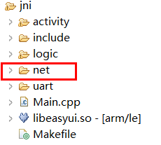
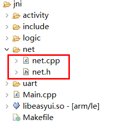

# socket网络编程
如果你熟悉Linux的socket编程，可以根据标准Linux socket编程接口进行网络编程。    

针对一些常用的socket编程实现操作，例如，建立TCP客户端，我们基于Linux 的标准接口做了简单的封装，方便使用。 如果需要，可以按步骤，将源码集成到自己的项目中。

## 移植步骤  
1. 在项目的jni文件夹下新建一个文件夹，命名为 `net`  
    
  
2. 下载 [net.h](assets/source/net.h) 、[ioutil.cpp](assets/source/ioutil.cpp) 两个文件，保存到`io`文件夹下。  

    

## 如何使用 
* 引入头文件 
  ```c++
  #include "io/ioutil.h"
  ```
* 写文件  
  ```c++
  //将“0123456789”这个字符串写入到123.txt这个文件中
  const char* filename = "/mnt/extsd/123.txt"; //文件保存的路径
  const char* str = "0123456789";
  ioutil::WriteFile(filename, str, strlen(str));
  ```

* 追加文件
  ```c++
  //将内容追加到文件的末尾，如果指定的文件不存在，则新建文件。
  const char* append_str = "abcdefgh";
  ioutil::AppendFile(filename, append_str, strlen(append_str));
  ```
  
* 读文件
  ```c++
  const char* filename = "/mnt/extsd/123.txt";
  //读取文件的所有内容，保存在content中
  string content = ioutil::ReadFile(filename);
  //将读到的每一个字节以16进制输出到日志
  for (size_t i = 0 ; i < content.size(); ++i) {
    LOGD("第%02d字节=0x%02X", i, content.data()[i]);
  }
  ```
  > [!Warning]
  > `ioutil::ReadFile`函数是将文件的所有内容读取到内存里，如果指定的文件过大，会导致内存不够，可能会造成异常。


* 连续写文件 ，适用于写大文件的情况
  ```c++
  const char* filename = "/mnt/extsd/123.txt";
  const char* append_str = "abcdefgh";
  ioutil::Writer w;
  if (w.Open(filename, false)) {
    for (int i = 0; i < 5; ++i) {
      w.Write(append_str, strlen(append_str));
      w.Write("\n", 1);
    }
    w.Close();
  }
  ```

* 连续读，适用于处理大文件的情况
  ```c++
  const char* filename = "/mnt/extsd/123.txt";
  ioutil::Reader r;
  if (r.Open(filename)) {
    char buf[1024] = {0};
    while (true) {
      int n = r.Read(buf, sizeof(buf));
      if (n > 0) {
        //有读到内容,输出每一个字节
        for (int i = 0; i < n; ++i) {
          LOGD("%02x", buf[i]);
        }
      } else if (n == 0) {
        //读取文件结束
        break;
      } else {
        //出错
        break;
      }
    }
    r.Close();
  }
  ```


## 测试代码  
```c++
/**
 * 当界面构造时触发
 */
static void onUI_init() {
  //写文件
  const char* filename = "/mnt/extsd/123.txt";
  const char* str = "0123456789";
  ioutil::WriteFile(filename, str, strlen(str));
  string content = ioutil::ReadFile(filename);
  LOGD("读取字节数%d, 内容:%s", content.size(), content.c_str());
  //追加文件
  const char* append_str = "abcdefgh";
  ioutil::AppendFile(filename, append_str, strlen(append_str));
  content = ioutil::ReadFile(filename);
  LOGD("读取字节数%d, 内容:%s", content.size(), content.c_str());

  ioutil::Writer w;
  if (w.Open(filename, false)) {
    for (int i = 0; i < 5; ++i) {
      w.Write(append_str, strlen(append_str));
      w.Write("\n", 1);
    }
  }
  w.Close();

  ioutil::Reader r;
  if (r.Open(filename)) {
    char buf[1024] = { 0 };
    while (true) {
      int n = r.Read(buf, sizeof(buf));
      if (n > 0) {
        //有读到内容,输出每一个字节
        for (int i = 0; i < n; ++i) {
          LOGD("%02x", buf[i]);
        }
      } else if (n == 0) {
        //读取文件结束
        break;
      } else {
        //出错
        break;
      }
    }
    r.Close();
  }

  content = ioutil::ReadFile(filename);
  LOGD("读取字节数%d, 内容:%s", content.size(), content.c_str());

  //如果是读取的二进制文件，不是文本，则应该这样获取二进制
  //将每一个字节以16进制输出
  for (size_t i = 0; i < content.size(); ++i) {
    LOGD("第%02d字节=0x%02X", i, content.data()[i]);
  }
}
```