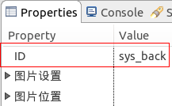

前面我们已经了解到了启动界面，进入启动界面后，我们可以再打开其他界面，进入第二级、第三级界面等等；接下来我们来了解一下如何打开、关闭其他界面；

## 打开应用界面
比如现在我们要打开**sub.ftu**对应的界面，根据前面分析启动界面的说明，我们可以知道该UI资源对应的界面对象为**subActivity**，这些都是工具帮我们自动生成的代码，我们不需要关注过多的细节，简单了解一下即可，接下来我们可以通过如下代码启动该界面：
```c++
EASYUICONTEXT->openActivity("subActivity");
```
假如我们想通过一个按钮点击跳转到**sub.ftu**界面，我们可以在按钮点击事件的回调接口中调用以上语句：
```c++
static bool onButtonClick_Button1(ZKButton *pButton) {
    // 跳转到sub.ftu界面
    EASYUICONTEXT->openActivity("subActivity");
    return false;
}
```
一般情况下，以上的调用代码就足够了，如果涉及到界面与界面间需要传递一些信息，如支付页面，我们就需要用到openActivity的第二个参数进行传参了：
```c++
Intent *pIntent = new Intent();
pIntent->putExtra("cmd", "open");
pIntent->putExtra("value", "ok");
EASYUICONTEXT->openActivity("subActivity", pIntent);
```
这样在**subLogic.cc**的`onUI_intent`回调中就可以接收到了：
```c++
static void onUI_intent(const Intent *intentPtr) {
	if (intentPtr) {
		// 键值解析
		std::string cmd = intentPtr->getExtra("cmd");		// "open"
		std::string value = intentPtr->getExtra("value");	// "ok"
		......
	}
}
```
注意：

	1. new出来的Intent不需要手动delete，由框架内部自动delete；
	2. putExtra只提供了string的键值对方式，如需传递int或其他类型的值，需转成string类型，在onIntent中收到后再做相应的转换

## <span id = "close_app">关闭应用界面</span>
通过上面的openActivity方法，我们打开了subActivity界面，这个时候我们想回退到原来的界面，怎么办呢？
我们可以通过以下代码返回到上一级界面：
```c++
EASYUICONTEXT->goBack();
```
如果是通过按钮触发返回的，我们可以直接通过工具设置一下按钮的ID值为`sys_back`，系统也会响应返回功能；  



如果我们进入了较多层级的界面，想要直接回退到我们的第一个启动界面，我们可以通过如下代码实现：
```c++
EASYUICONTEXT->goHome();
```
即回退到主界面。
另外，如果也是通过按钮触发的，我们也可以通过工具设置一下按钮的ID值为`sys_home`，系统也会响应回主界面的功能；
最后，我们还可以通过EasyUIContext的closeActivity方法关闭应用界面，比如我们要关闭subActivity界面：
```c++
EASYUICONTEXT->closeActivity("subActivity");
```
该方法需要调用者清楚要关闭应用的名称；另外，该方法不能关闭启动界面，启动界面是常在的。
