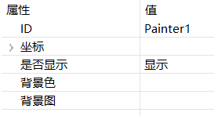
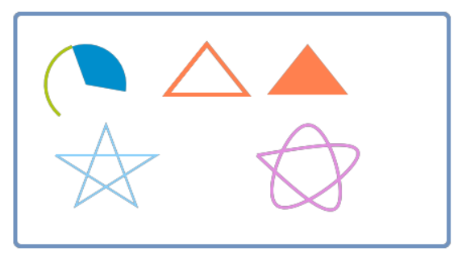

# 画布

画布控件提供了简单几何图形绘制接口。
## 如何使用  
 创建一个 **画布** 控件，默认的画布控件是透明的。根据需求，可以自行添加背景图或者修改背景色。  

   

### 代码操作  
通过**画布**控件的指针，即可调用接口绘制图形。
该控件几乎所有功能都需要代码实现，示例如下。
```c++
static void onUI_init() {

    /**
     * 绘制一个圆角矩形边框
     */
    mPainter1Ptr->setLineWidth(4);
    mPainter1Ptr->setSourceColor(0x7092be);
    mPainter1Ptr->drawRect(10, 10, 430, 230, 5, 5);

    /**
     * 绘制一段圆弧
     */
    mPainter1Ptr->setLineWidth(3);
    mPainter1Ptr->setSourceColor(0xadc70c);
    mPainter1Ptr->drawArc(80, 80, 40, 40, -20, -120);

    /**
     * 绘制一段扇形
     */
    mPainter1Ptr->setLineWidth(3);
    mPainter1Ptr->setSourceColor(0x008ecc);
    mPainter1Ptr->fillArc(80, 80, 40, 40, -20, 120);


    /**
     * 绘制三角形
     */
    mPainter1Ptr->setLineWidth(4);
    mPainter1Ptr->setSourceColor(0xff804f);
    mPainter1Ptr->drawTriangle(200, 40, 160, 90, 240, 90);//空心三角形
    mPainter1Ptr->fillTriangle(300, 40, 260, 90, 340, 90); //实心三角形

    /**
     * 绘制直线
     */
    MPPOINT points1[] = {
            {50 , 150},
            {150, 150},
            {70 , 200},
            {100, 120},
            {130, 200},
            {50 , 150}
    };
    /** 根据提供的多个点坐标依次连接成线 */
    mPainter1Ptr->setLineWidth(2);
    mPainter1Ptr->setSourceColor(0x88cffa);
    mPainter1Ptr->drawLines(points1, TABLESIZE(points1));


    /**
     * 绘制曲线
     */
    MPPOINT points2[] = {
            {250, 150},
            {350, 150},
            {270, 200},
            {300, 120},
            {330, 200},
            {250, 150}
    };
    mPainter1Ptr->setLineWidth(3);
    mPainter1Ptr->setSourceColor(0xe28ddf);
    /** 根据提供的多个点坐标连接为曲线 */
    mPainter1Ptr->drawCurve(points2, TABLESIZE(points2));
}
```
# 样例代码
演示了**画布**控件的使用  

 

画布控件的具体使用方法，参见[样例代码](demo_download.md#demo_download) 里的 `PainterDemo` 工程 