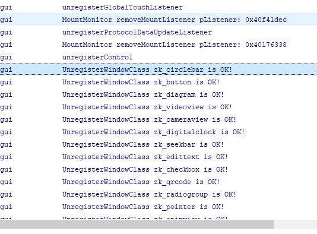

# 常见问题
* ### 旧工具创建的项目导入到新工具，编译提示 **ndk-build找不到**  
  如果你安装新工具后，并且将旧工具删除了，那么由旧工具创建的项目，导入到新工具后，编译可能会提示 **ndk-build找不到**。  
  可以通过手动替换下列文件来解决。  
  下载 [z11s项目配置文件](assets/z11sproject-configuration.zip)，解压后，将文件夹内的全部内容拷贝到项目文件夹下，**注意：本操作将会覆盖共三个文件，请注意备份。**
  覆盖文件后，再重启工具即可解决。
  
* ### 在UI主线程中做耗时的操作导致插卡不显示升级界面
界面的刷新显示是在UI主线程中处理的，如果UI主线程中有做一些耗时的操作或者出现程序死循环的情况，就会影响UI的刷新，从而导致插卡不显示升级界面；
`onUI_init`、`onUI_intent`、`onUI_show`、`onUI_hide`、`onUI_quit`、`onUI_Timer`及控件相关的一些回调接口，这些函数都是在UI主线程中调用的，所以出现这种情况，要先检查一下有没有在这些函数中做耗时的操作；
出现这种情况，只能机器插卡重新开机，系统起来后会优先检测是否需要升级，这样就可以正常显示升级界面了。

* ### 无法下载调试/下载调试失败
  首先确认电脑与屏的连接正确，如果是带WIFI的屏，那么仅支持WIFI连接，无法使用USB线连接；同理，如果是不带WIFI的屏，那么只能通过USB线连接，如果USB连接正常，电脑会识别为一个USB设备。  
  确定了所支持的连接方式后，到开发工具 菜单栏中，选择  **调试配置->ADB配置**，设置对应的连接方式，保存。  
  再次尝试下载。   
  [如何通过ADB下载调试](adb_debug.md)
  

* ### 程序突然自己重启或卡住  
  首先程序出现非预期的情况时，一定要查看日志([如何查看日志](logcat.md))，尝试反复重现问题，根据日志确定问题代码。  
  如果程序崩溃导致重启，日志上一般会出现类似日志。程序启动初始化时都会输出这些日志，所以可通过这个判断程序是否出现了重启。 
  
    
  
  程序崩溃的大部分原因可以归为指针的错误用法。例如  
  * 空指针 
  * 数组越界
  * 没有注意指针的生命周期，内存释放后却还在使用  
  
  等等  
  由于项目使用C语言及C++语言编程，在指针内存方面，难免需要处理裸指针，这就需要我们额外细心。
  还有种崩溃，可能是没注意 **除数不能为0** 这种错误。
  
  如果程序卡住，从日志上看，也没有重启的现象， 那我们可以从 **线程死锁**、**是否代码死循环了** 、**有长时间的耗时操作，造成卡死的假象** 这些情况来分析。

#### 更多问题请前往[论坛](http://bbs.zkswe.com/forum.php)搜索或提问