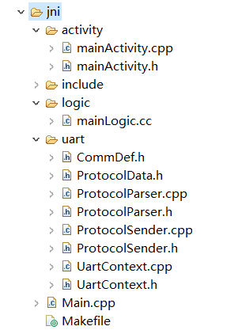

# <span id = "project_structure">FlyThings项目代码结构介绍</span>
开始编写代码之前，首先要了解一个FlyThings项目的基本构成，然后你就能知道自己的代码应该添加到哪个位置。  
对于一个基本的FlyThings项目，它的目录结构是这样的：  

  
大致分为 **jni** 、**resources** 、 **ui** 三个文件夹。下面分别解释各个文件夹的作用。    
* ## ui 文件夹  
  展开 **ui** 文件夹   
  
      
  
  可以看到默认包含了一个 **main.ftu** 文件。**ftu** 是**FlyThings** 项目UI文件的后缀名。每一个 **ftu** 文件对应一个应用界面。通常，一个应用包含多个界面，所以你需要在 **ui** 文件夹下创建多个 **ftu** 文件。添加新的 **ftu** 文件，可以参考 [如何新建FlyThings UI文件](new_flythings_ui_file.md)。 为了描述方便，以后的教程中，统一将 **ftu** 文件称为 **UI文件**。  
  你可以双击打开 **UI文件** ，并对它进行编辑，并且可以即时预览效果。编辑 **UI** 文件的具体步骤，可以参考**控件介绍**的教程。  
  编辑结束后，你就可以开始 **“编译”**  ([如何编译](how_to_compile_flythings.md)）  
  > [!Note]
  > **注意： 这里所说的编译不仅仅是编译源代码，还包括对 ui文件的预处理，以及生成模板代码等一系列操作，但是这些都是自动化的，你无需手动操作。编译这一动作背后的所有具体操作，请参考 [具体编译过程以及UI文件与源代码的对应关系](ftu_and_source_relationships.md#ftu_and_source_relationships)，看完后，相信你会更容易理解，并且快速上手开发**

* ## resources 文件夹  
  这个文件夹的内容就比较简单，主要用来存放项目的各种资源文件，包括 图片、字体、输入法配置文件等。如果你还有其他资源文件也可以添加到该文件夹，该文件夹会完全拷贝到机器中。
但是，由于机器自身存储空间的限制，不建议将大文件存放到该目录，更推荐你将较大的资源文件存放到TF卡中。

  我们可以在代码中获取resources目录下的某个文件的绝对路径。 
例如： 如下代码可以获取resources/test.txt的绝对路径。
 ```c++ 
 #include "manager/ConfigManager.h"
 std::string resPath = CONFIGMANAGER->getResFilePathEx("test.txt");
 ```
* ## jni 文件夹  
   该文件夹主要为存放代码文件，她还包含了多个部分的代码。我们将 **jni** 文件夹展开  
     
   可以看到，它包含了 **activity** 、 **include** 、**logic** 、**uart** 、**Main.cpp**、 **Makefile** 共6个部分，每个部分作用如下：  
   * ### activity 子文件夹  
     存放UI文件的基础类代码。每一个UI文件，经过编译后，都会生成相同前缀名的`Activity`类和`Logic.cc`文件。例如：ui文件夹下有一个 **main.ftu**，那么经过编译后，会生成 `mainActivity.h`、`mainActivity.cpp`以及`mainLogic.cc`， `mainActivity`类会存放在 **activity** 文件夹中，`mainLogic.cc`文件会存放在 **logic** 文件夹中。  
     > [!Warning] 
     > **强烈推荐不要手动修改 activity 文件夹下的代码，特殊情况除外**
     
   * ### logic 子文件夹   
    存放具体的逻辑代码。与上面的描述相同，每一个UI文件在编译后都会生成相对应前缀名的 **Logic.cc** 文件，**注意：我们的自定义代码，主要就是添加在这些 Logic.cc文件中**。
   * ### include 子文件夹
   这里主要存放系统相关的头文件、所有控件相关的头文件。便于编译。
   * ### uart 子文件夹  
    顾名思义，该文件夹存放串口操作相关的代码，包括读写串口，协议解析等。
   * ### Main.cpp
    整个FlyThings应用的入口代码，包括选择开机的界面以及一些初始化，一般情况不需要修改该文件。
   * ### Makefile/Android.mk、Application.mk
    编译配置文件，包含了具体的源码编译过程，一般情况下不需要修改  

在编译通过后，会在项目下生成 **libs**目录，和 **obj** 目录，它们分别是编译的目标存放目录和编译的中间文件目录，这两个都可以自行清理或者直接删除都没有关系。