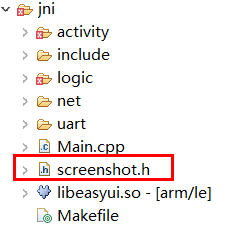

# 截屏
产品开发完毕后，编写使用说明书时，可能需要运行界面的截图，可参考如下代码截屏。  
## 准备
1. 下载[screenshot.h](https://docs.flythings.cn/src/screenshot.h) 源文件，保存到项目 `jni`目录下。  
  
  
## 使用

* 引用头文件
  ```c++
  #include "screenshot.h"
  ```
* 调用接口进行截屏  
  ```c++
  static bool onButtonClick_Button1(ZKButton *pButton) {
    //截取当前屏幕，保存为bmp图片，保存到TF卡目录下
    //每调用一次该函数，保存的图片名递增
    //例如  screenshot01.bmp、screenshot02.bmp、screenshot03.bmp
    Screenshot::AutoSave();
    return false;
  }
  ```
  默认图片保存到TF卡，所以尽量插上TF卡再截屏。  
  如果需要保存到其他位置，可以自行修改源码。   
  
 