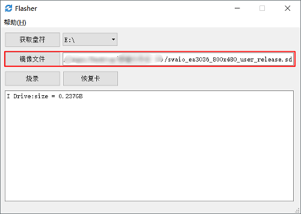
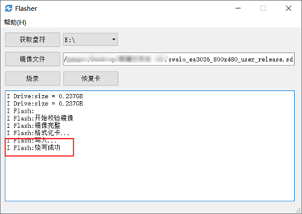
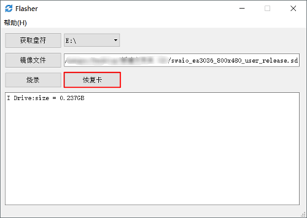
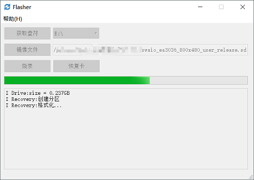
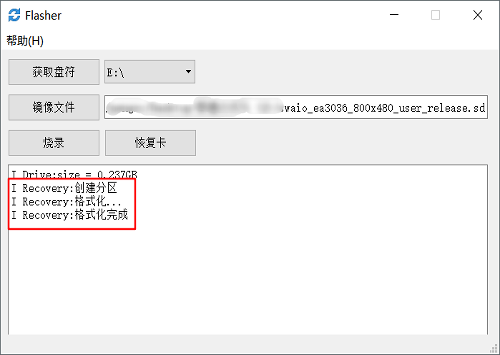

      
## 制作刷机卡
>[!Warning]
> **注意： TF卡的容量最大支持16G，过大机器无法识别TF卡，无法升级。 最新软件刷机包，请到 QQ群：[371608200](//shang.qq.com/wpa/qunwpa?idkey=da6e12d1773a7e55295a0accd2a46ad51aece61657fe55a2f8277f4cd91dc56a) 群共享下载，注意找自己机器对应版本的软件，见机器背面[标签](board_tag_explain.md)，否则升级可能会造成异常！**

1. 下载[电脑端刷机工具](http://download.zkswe.com/tool/Flasher.zip)
2. 选择电脑上的TF卡盘符  

   

3. 指定升级的镜像文件  

    

4. 点击烧录
 
    
    
    

5. 烧写成功后，拔出TF卡，插入机器，再重新上电，即可进行升级  
   >[!Warning]
   > **注意：升级进度条完成后，需要及时拔出TF卡，防止机器重启后反复升级**

## 恢复卡步骤
1. 选择电脑上的TF卡盘符  

    

2. 点击 恢复卡  

    
    
    

3. 格式化完成后，则卡恢复正常使用

