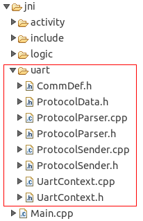
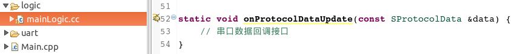

# 串口简介
下面这张图，是最最最简单的一个通讯模型；屏和MCU之间通过串口进行通信，它们之间只要定好协议，就可以进行交互了

这里有点需要注意的，传统的串口屏它们是作为从机端设备，通过MCU发相应的指令来控制它们；而我们的串口屏不一样，我们的屏是具有逻辑的，它可以自己实现交互，在这里作为主机端。

如果由自己从头来开发这部分通讯代码，那工作量将是巨大的；为了简化开发流程，使开发人员更多的关注业务逻辑的开发，我们的工具在新建工程时会自动生成串口通讯的代码：  

同时，我们也提供了协议数据与界面交互的回调接口：   

开发人员更多的是关注数据在UI界面上的展示，而通讯部分则由我们的框架自动完成。
通讯框架中的协议解析部分需根据开发人员使用的通讯协议做相应的改动，接下来的[通讯框架讲解](serial_framework.md)这一章节中我们会重点介绍原理及需要修改的部分，以及通过[通讯案例实战](serial_example.md)这一章节中的一些案例来加深我们对这套通讯框架的认识。