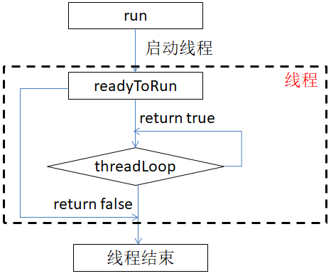
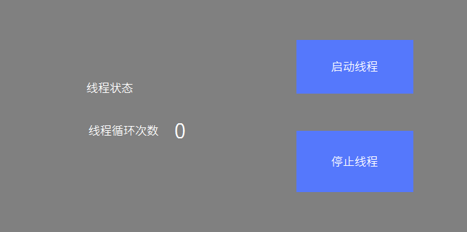

# 线程
系统支持`pthread`线程，如果你了解 `pthread`接口，也可以用`posix`接口实现线程。  
另外，我们还提供一个对	`pthread`的封装类。该类包括如下三个部分
* Thread.h：线程类
* Mutex.h：锁类
* Condition.h：条件变量类

## 线程的使用
1. 引入头文件，继承`Thread`类，实现`virtual bool threadLoop()`函数， 按需选择实现readyToRun函数。

  ```c++
    #include <system/Thread.h>
    
    class MyThread: public Thread {
    public:
      /**
       * 线程创建成功后会调用该函数，可以在该函数中做一些初始化操作
       * return true   继续线程
       *        false  退出线程
       */
      virtual bool readyToRun() {
        LOGD("Thread 已经创建完成");
        return true;
      }

      /**
       * 线程循环函数
       *
       * return true  继续线程循环
       *        false 推出线程
       */
      virtual bool threadLoop() {
        LOGD("线程循环函数");

        //检查是否有退出线程的请求，如果有，则返回false，立即退出线程
        if (exitPending()) {
          return false;
        }

        //累加计数，并显示到屏幕上
        loop_count += 1;
        mTextView2Ptr->setText(loop_count);

        //为了方便观察，这里添加休眠500ms
        usleep(1000 * 500);

        //返回真，继续下次线程循环
        return true;
      }
    };
  ```
  
2. 实例化线程对象  
  ```c++
  static MyThread my_thread;
  ```
3. 启动线程
  ```c++
    //调用线程类的run函数可以启动线程，  
    //参数为线程名，可以任意指定。
    my_thread.run("this is thread name");
  ```
4. 停止线程  
  `Thread`类提供了两个请求退出线程的函数，同步与异步的区别，具体使用如下：
  * **void requestExitAndWait()**  
    ```c++
    //请求退出线程，并且等待，直到线程完全退出后，该函数才返回
    my_thread.requestExitAndWait();
    ```
  * **void requestExit()**  
    ```c++
    //请求退出线程，发出请求后该函数立即返回，但此时，并不代表线程也完成退出了
    my_thread.requestExit();
    ```
   
   调用上面两个函数中的任意一个后，在`threadLoop`函数中，我们就可以通过 `bool exitPending()`成员函数判断是否有退出线程的请求。  
  ```c++
  virtual bool threadLoop() {
    LOGD("线程循环函数");

    //检查是否有退出线程的请求，如果有，则返回false，立即退出线程
    if (exitPending()) {
      return false;
    }
    return true;
   }
   ```
    
   > [!Note]
   > 注意，以上函数只是添加一个请求退出线程的标记而已，并不是强制终止线程。    
   > 如果你在 `threadLoop`函数中一直执行某些操作，让 `threadLoop`函数一直无法结束，那么该线程是不会停止的。  
   > 正确的做法是，在`threadLoop`中检查退出线程请求，或者检查某个终止条件，然后返回 `false`。
   
   ---
   > [!Warning]
   > 禁止在`threadLoop`函数中调用 `requestExitAndWait`和`requestExit`函数，可能造成死锁。  

5. 判断线程是否还在运行  
  ```c++
  if (my_thread.isRunning()) {
    mTextView4Ptr->setText("正在运行");
  } else {
    mTextView4Ptr->setText("已停止");
  }
  ```

## Thread流程图
在经过上面各个步骤的讲解后，再结合流程图，应该会有更深的理解。     


## 样例代码  
见 [样例代码](demo_download.md#demo_download) 控件样例里的 `ThreadDemo` 工程  
    


