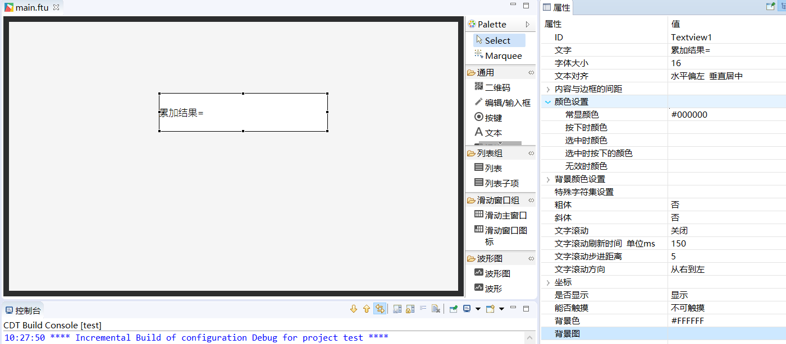
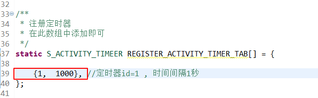
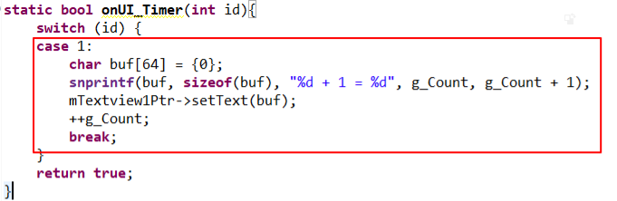
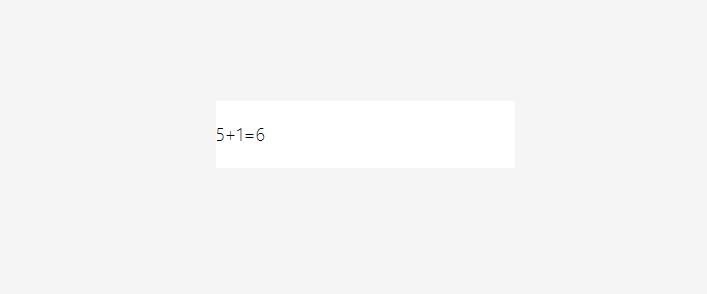

# <span id = "timer">定时器</span>
在某些情况下，我们可能需要定时做一些操作。比如，间隔一定时间发送心跳包、定时查询数据刷新UI界面、或者做一些轮询的任务等等。如果你有以上的这些需求，那么定时器是一个方便的选择。
## 如何使用定时器
1. 注册定时器  
   为了方便使用，我们以填充结构体的形式来添加定时器。  
在Logic.cc文件中，默认会有这样一个结构体数组：  
```c++
/**
 * 注册定时器
 * 在此数组中添加即可
 */
static S_ACTIVITY_TIMEER REGISTER_ACTIVITY_TIMER_TAB[] = {
	//{0,  6000}, //定时器id=0, 时间间隔为6秒
	//{1,  1000},
};
```
如果我们想要添加一个定时器时，只需要在这个数组中添加结构体即可。  
这个结构体的定义如下：
```c++
typedef struct {
	int id; // 定时器ID ， 不能重复
	int time; // 定时器时间间隔  单位/毫秒
}S_ACTIVITY_TIMEER;
```
2. 添加定时器的逻辑代码  
   在数组中注册定时器后，当某一个定时器触发时，系统将调用对应 **Logic.cc** 文件中的 `void onUI_Timer(int id)`函数，针对这个定时器的所有操作代码，就是添加在这个函数中，函数具体定义如下：  
   ```c++
   /**
    * 定时器触发函数
    * 不建议在此函数中写耗时操作，否则将影响UI刷新
    * @param id
    *         当前所触发定时器的id，与注册时的id相同
    * @return true
    *             继续运行当前定时器
    *         false
    *             停止运行当前定时器
    */
   static bool onUI_Timer(int id){
	 switch (id) {

		default:
			break;
	 }
     return true;
   }
   ```
   该函数同样是随 **Logic.cc** 文件默认生成。  
   注意函数的参数 **id** ，它与结构体数组中定义的 **id** 值相同，我们可以根据 **id** 值判断当前触发的是哪一个定时器，从而做一些针对性的操作。

> [!Note]
> **注意：每个界面的定时器都是独立的，不同界面定时器的id可以相同；<br/>注册的定时器，只要界面不销毁（见[界面活动周期](activity_life_cycle.md)），都会一直在运行；<br/>注册了无需手动停止，界面销毁了就会自动停止了。**

##  具体样例  
接下来我们以一个具体的例子讲述定时器的使用。  
假设我们需要实现一个这样的功能： 有一个整形变量，每隔一秒钟，将变量累加1，并且将最新结果显示到屏幕上。    
具体实现过程如下：
1. 首先我们在UI文件中添加一个文本控件，用于显示累加的结果。    

      
2. 注册定时器， 在 **mainLogic.cc** 的定时器数组中，添加一个结构体， 定时器id为1，时间间隔为1秒。注意时间单位为毫秒。

    
    
3. 在 **mainLogic.cc** 中，定义静态整型变量，初始化为0   
    
      
4. 在`void onUI_Timer(int id)`函数中，添加累加代码，并将其显示到文本控件中。  
    
    
5. 编译运行   
    
      

## 样例代码  
 见 [样例代码](demo_download.md#demo_download) 里的 `TimerDemo` 工程