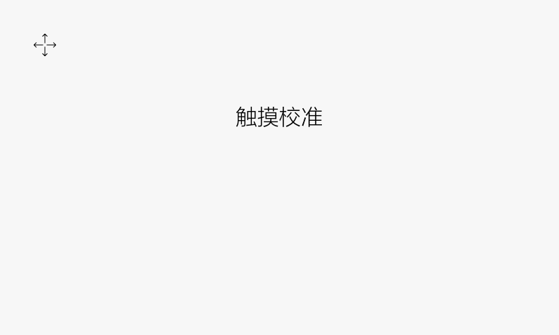

# 触摸校准
电阻屏的机器刷机后系统第一次开机起来会进行一次触摸校准，校准界面如下：



点击 “十字图标” 进行校准；之后想再重新进行校准，我们有以下3种方式：
1. 通过工具修改工程属性，将**开机启动触摸校准程序**选项勾选上，这样每次开机起来后就会先进入触摸校准界面：

     <br/>
2. 在TF卡根目录下创建一个文件**zktouchcalib** （注意：该文件是没有后缀名的），插卡后就会进入触摸校准界面

     <br/>
3. 通过代码启动触摸校准界面
```c++
EASYUICONTEXT->openActivity("TouchCalibrationActivity");
```
