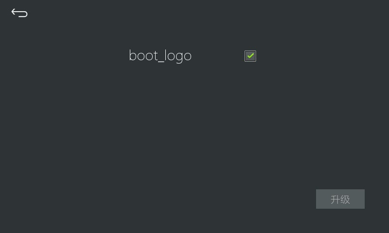

# 开机LOGO
## 更新开机LOGO
1. 首先准备一张开机LOGO图片，图片必须满足以下条件：  
  1. 图片名称固定为 `boot_logo.JPG`，注意，文件后缀是大写的 **JPG**； 其他名称将无法识别。  
    **Windows系统电脑的用户务必打开资源管理器的“显示扩展名”功能，确保完整的文件名称正确无误**。    
  2. 图片分辨率必须与屏幕分辨率完全相同，以像素为单位。
  3. 图片不宜过大，否则升级失败。最好保持在**100KB**以内，但是不同的系统版本所支持的大小也有差异。  
     由于系统开机时，支持的压缩算法有限，在电脑上显示的大小并不代表系统内解压、再压缩后的占用大小。
  4. 升级时，如果提示“镜像大于分区大小”，说明图片对于该系统版本来说，仍然过大。
  5. 开机LOGO图片应尽量简单，**强烈推荐以纯色为背景，再加上简单的图标或文字，这样能有效减小图片大小。**； 

2.  将 `boot_logo.JPG` 拷贝到TF卡根目录下
3.  将TF卡插入到机器中，然后设备会自动弹出升级提示。选择`boot_logo` 然后点击升级即可。
4.  升级完成后系统会关机重启。此时拔出TF卡。防止系统再次升级。 

    

## 更加丰富的“开机LOGO”
开机LOGO的功能有限，如果您有更加丰富的需求，可以采用如下方式曲折实现
1. 用一张纯黑色的图片升级为开机LOGO。
2. 应用程序的第一个界面视为你的”开机LOGO”
3. 应用程序的第一个界面尽量不要有耗时操作，否则会拖慢程序的启动时间。

## 延长开机LOGO的显示时间
开机LOGO的时间依赖应用程序的启动时间。
应用程序的第一个界面完整加载后，就会覆盖开机LOGO。
所以只要在第一个界面的 `onUI_init` 函数里加上`sleep`操作，即可变相延长开机LOGO的显示时间。

