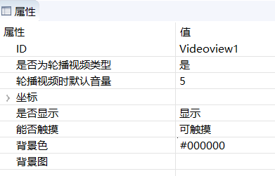
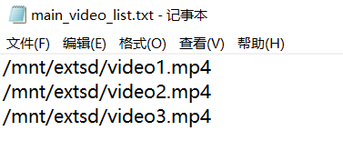

# 视频
FlyThings还提供了视频播放的控件。  

> [!Note]
> 视频播放功能并非所有版本的机器都支持！如果需要正常使用该功能，那么请购买带有多媒体功能的机器版本。 
> 

## 使用控件轮播视频  
1. 首先，创建一个 **视频** 控件，默认背景色为黑色。
2. 查看 **视频** 的属性表  

     

   其中，有个属性为 **是否为轮播视频类型**   
如果选择 **是** ，那么每次进入这个UI界面时，会自动读取TF卡目录下的配置文件，循环播放配置文件中指定的视频。 退出页面自动停止播放。  这个属性非常适合仅需要播放视频、且不存在用户干预播放的场景，比如轮播广告机、自动播放一段短视频等。  
如果选择 **否** ，仅仅只会创建一个视频的渲染区域，除此以外没有其他操作。那么，你就需要自己去操作视频播放了。

3. 创建视频配置文件  
上面说到，如果是**视频轮播类型**，会自动读取视频配置文件。  你需要自行创建它。  
这个配置文件需要位于TF卡根目录下，文件名是 **XXXX_video_list.txt** 
XXXX 表示对应的UI文件前缀名。例如：  我在 **main.ftu** 中添加了一个视频控件，那么，对应的配置文件名为 **main_video_list.txt**  
配置文件以行为单位， 每行为视频文件的绝对路径，如果视频文件也位于TF卡根目录，那么直接填写 `/mnt/extsd/` 加上 视频文件名即可。   

  

  **注意： 防止编码问题导致视频文件读取失败，请尽量使用英文命名视频文件。**
4. 程序运行后，即可自动轮播配置文件中的视频。

## 播放指定视频文件
1. 创建一个 **视频** 控件 
2. 将属性 `是否为轮播视频类型` 置为 否。
3. 添加代码，控制播放逻辑  
  播放
  ```c++
  //播放test.mp4文件， 从时间0开始播
  mVideoView1Ptr->play("/mnt/extsd/test.mp4", 0);
  ```
  暂停
  ```c++
  //暂停播放
  mVideoView1Ptr->pause();
  ```
  恢复播放
  ```c++
  //恢复播放
  mVideoView1Ptr->resume();
  ```
  停止播放
  ```c++
  mVideoView1Ptr->stop();
  ```
  跳转到指定时间播放
  ```c++
  //跳转到10秒的位置
  mVideoView1Ptr->seekTo(10 * 1000);
  ```
  设置播放音量， 范围 0~1.0
  ```c++
  //设置音量为0.5
  mVideoView1Ptr->setVolume(0.5);
  ```
  判断是否正在播放
  ```c++
  bool state = mVideoView1Ptr->isPlaying();
  if （state) {
    LOGD("正在播放");
  }
  ```
  获取视频的总时长，单位毫秒
  ```c++
  int n = mVideoView1Ptr->getDuration();
  ```
  
  获取视频当前播放位置，单位毫秒
  ```c++
  int n = mVideoView1Ptr->getCurrentPosition();
  ```
  
  视频是异步播放，自动生成的关联函数中，会通知我们视频播放的状态  
  ```c++
    static void onVideoViewPlayerMessageListener_VideoView1(ZKVideoView *pVideoView, int msg) {
        switch (msg) {
        case ZKVideoView::E_MSGTYPE_VIDEO_PLAY_STARTED:
          LOGD("视频开始播放");
            break;
        case ZKVideoView::E_MSGTYPE_VIDEO_PLAY_COMPLETED:
          LOGD("视频播放结束");
            break;
        case ZKVideoView::E_MSGTYPE_VIDEO_PLAY_ERROR:
          LOGD("视频播放出错");
            break;
        }
    }
  ```
  
## 完整视频播放器的实现
如果你对视频播放有更高的要求，需要控制播放/暂停、拖动视频进度条等。    
可以参考[样例代码](demo_download.md#demo_download)中的VideoPlayerDemo项目，它实现了一个完整的播放器。

## 样例代码
在该样例中， 实现了视频的循环播放，以及调整视频音量。   
具体实现，参考[样例代码](demo_download.md#demo_download)中的VideDemo项目。

 