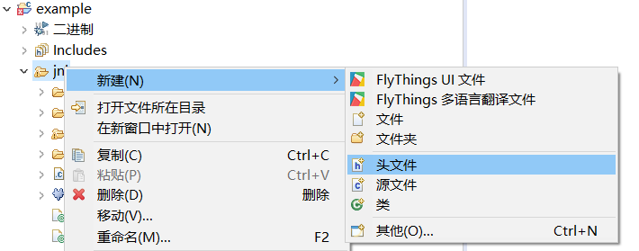
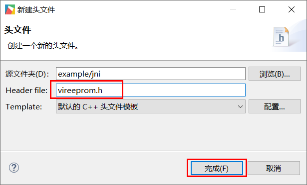

# 模拟EEPROM功能

EEPROM（带电可擦写可编程读写存储器）是用户可更改的只读存储器（ROM），其可通过高于普通电压的作用来擦除和重编程（重写）。
## 模拟原理
本系统基于Linux，自带文件系统，带均衡擦写算法。将保存的数据写入到 **NorFlash**（不低于10万次擦写次数，注意不是**Nandfalsh**，**NandFlash** 出现坏块后就是各种风险了）。
FlyThings OS内部预留了 **/data** 分区，用于用户数据，为了方便熟悉单片机操作的用户使用，我们在**/data**分区下创建一个文件来模拟一个EEPROM空间。    （/data分区的大小为1M或几百KB不等，依具体系统版本而定）  
是不是感觉特别像国内炼丹炉里面出来的STC大法的单片机。  
## 使用场景
掉电保存数据。
## 实现步骤  
1. 首先在项目的 **jni** 目录下创建一个头文件。  
   选中项目下的 **jni** ，点击鼠标右键，在弹出的上下文菜单中选择 **头文件** 选项, 然后命名为 **vireeprom.h**， 点击完成。  
   
     
     

2. 将以下代码完整拷贝到刚才添加的头文件中. (刚才创建头文件时，可能会自动添加一些内容，将这些内容删除)  
   这些代码实现了EEPROM的模拟功能。  
    ```c++
    #ifndef JNI_VIREEPROM_H_
    #define JNI_VIREEPROM_H_

    #include <stdio.h>
    #include <string.h>
    #include <unistd.h>
    /**
     * 模拟EEPROM的存储大小，字节为单位,建议不宜过大
     */
    #define EEPROM_SIZE 1024
    /**
     * 实际保存为文件 /data/eeprom.eep
     */
    #define EEPROM_FILE  "/data/eeprom.eep"

    class VirEEPROM {

    public:
      VirEEPROM() {
        memset(buff_, 0, sizeof(buff_));
        file_ = fopen(EEPROM_FILE, "rb+");
        if (file_) {
          fread(buff_, 1, EEPROM_SIZE, file_);
          fseek(file_, 0, SEEK_END);
          int f_size = ftell(file_);
          //调整文件到合适大小
          if (f_size != sizeof(buff_)) {
            ftruncate(fileno(file_), sizeof(buff_));
            fseek(file_, 0, SEEK_SET);
            fwrite(buff_, 1, sizeof(buff_), file_);
            fflush(file_);
            sync();
          }
        } else {
          file_ = fopen(EEPROM_FILE, "wb+");
          //调整文件到合适大小
          ftruncate(fileno(file_), sizeof(buff_));
        }
      }
      virtual ~VirEEPROM() {
        if (file_) {
          fflush(file_);
          fclose(file_);
          sync();
        }
      }
      /**
       * 返回值：小于0 是失败的，大于0是实际写入的字节数
       * 参数：value需要保存的数据指针，可以是结构体指针，char*,int*……，size是要保存的数据大小
       * 使用举例：
       * const char buff[]="12345678";
       * VIREEPROM->WriteEEPROM(0,buff,sizeof(buff);
       */
      int Write(int addr, const void* value, int size) {
        if (file_ == NULL) {
          return -1;
        }
        if ((addr >= EEPROM_SIZE) || ((addr + size) > EEPROM_SIZE)) {
          //超出大小
          return -2;
        }
        memcpy(buff_ + addr, value, size);
        if (0 != fseek(file_, addr, SEEK_SET)) {
          return -3;
        }
        int n = fwrite((char*)value, 1, size, file_);
        fflush(file_);
        sync();
        return n;
      }
      /**
       * 返回值：小于0 是失败的，大于0是实际读取到的字节数
       * 参数：value需要读取的数据指针，可以是结构体指针，char*,int*……，size是要读取的数据大小
       * 应用举例：
       * char buff[9];
       * VIREEPROM->ReadEEPROM(0,buff,sizeof(buff);
       */
      int Read(int addr,void* value,int size) {
        if (file_ == NULL) {
          return -1;
        }
        if ((addr >= EEPROM_SIZE) || ((addr + size) > EEPROM_SIZE)) {
          //超出大小
          return -2;
        }
        memcpy(value, buff_ + addr, size);
        return size;
      }
      /**
       * 返回值：
       *     0    成功
       *     小于0 失败
       */
      int Erase() {
        if (file_ == NULL) {
          return -1;
        }
        if (0 != fseek(file_, 0, SEEK_SET)) {
          return -2;
        }
        memset(buff_, 0, sizeof(buff_));
        if (sizeof(buff_) != fwrite(buff_, 1, sizeof(buff_), file_)) {
          return -3;
        }
        fflush(file_);
        sync();
        return 0;
      }

      static VirEEPROM* getInstance() {
        static VirEEPROM singleton;
        return &singleton;
      }
    private:
      unsigned char buff_[EEPROM_SIZE];
      FILE* file_;
    };

    #define VIREEPROM  VirEEPROM::getInstance()

    #endif /* JNI_VIREEPROM_H_ */

    ```

3. 至此准备工作已经完成，我们再写一些例子测试是否正常。  
   打开 `mainLogic.cc` 源文件，先在文件顶部引用刚才的头文件。  
   ```c++
   #include "vireeprom.h"
   ```
   
   测试代码  
   ```c++
   static void onUI_init(){
      //把value数组，从地址0开始，依次写入
      char value[4] = {1, 2, 3, 4};
      VIREEPROM->Write(0, value, sizeof(value));

      //从0地址开始读，依次读取4个字节 ，读取的内容保存到buf中
      char buf[4] = {0};
      VIREEPROM->Read(0, buf, sizeof(buf));
      //输出日志
      LOGD("读出的数据： %02x, %02x, %02x, %02x", buf[0], buf[1], buf[2], buf[3]);
      
      //将eeprom全部清空为0
      VIREEPROM->Erase();
   }
   ```
   
   
   
   